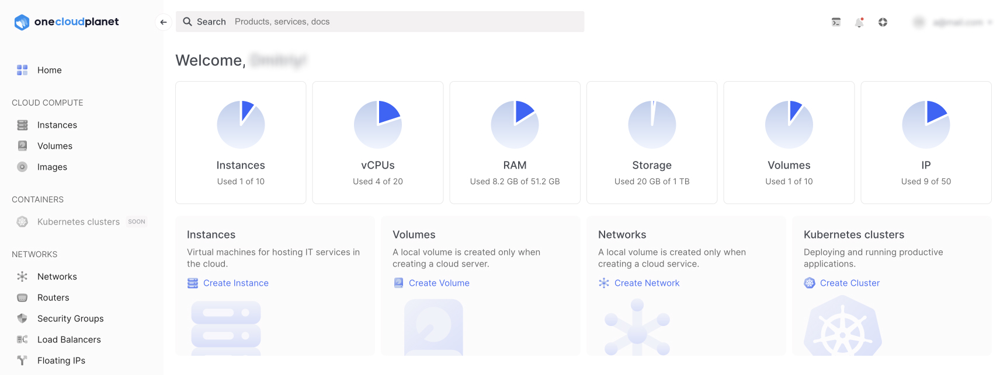

# Привітання

import CustomComponent from './customBar.js'

This user guide contains functional documentation for all features available in the OneCloudPlanet cloud platform control panel.

<CustomComponent/>

Before delving into this user guide, we recommend that you familiarize yourself with the basic concepts below. They will help you understand how OneCloudPlanet works.