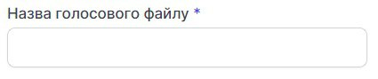
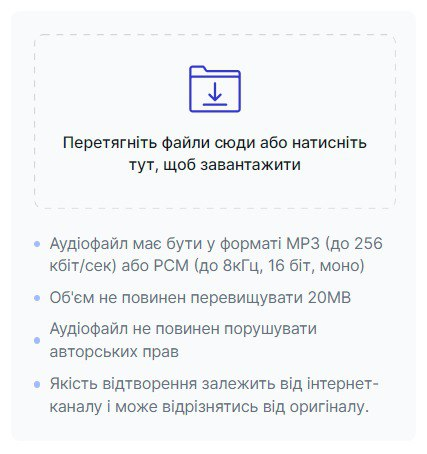
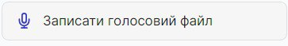
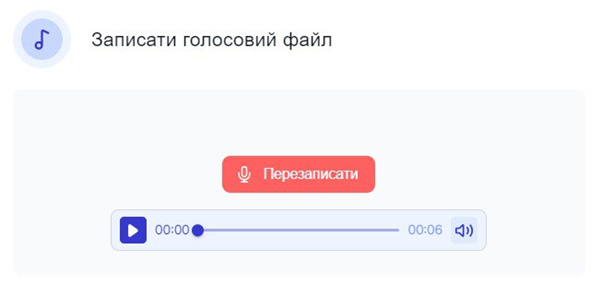

# Додати голосовий файл

Голосові файли — це голосові аудіозаписи, які чує клієнт, звернувшись до Вас.
	
### Як додати голосовий файл?

1.	Натисніть **Аудіо файли**.
 
 

2.	Перейдіть до **Голосові файли**.
 
 

3.	Натисніть Додати голосовий файл.
 
 

4.	Придумайте та введіть назву голосового файлу.
 
 

5.	Перетягніть голосовий файл або натисніть на вікно завантаження.
 
 
 
**Будьте уважні!** Голосовий файл має бути у форматі мр3 або рсм. Обʼєм файлу не повинен перевищувати 20 мб.

 
6.	Також у Вас є можливість самостійно записати голосовий файл. Для цього натисніть **Записати голосовий файл**.
 
 

7.	Щоб розпочати запис, натисніть на червону кнопку.
 
 

8.	Щоб завершити запис, натисніть на кнопку ще раз.
 
 

9.	Після запису у Вас є можливість прослухати та перезаписати голосовий файл.
 
 

10.	Натисніть **Зберегти**.
 
 
 