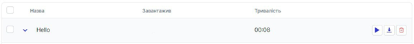
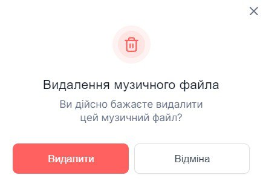

# Видалення голосового файлу
	
### Як видалити голосовий файл?

1.	Натисніть **Аудіо файли**.
 
 
 
2.	Перейдіть до **Голосові файли**.
 
 

3.	Натисніть на іконку видалення.
 
 

4.	У вікні підтвердіть дію кнопкою **Видалити**.

 
