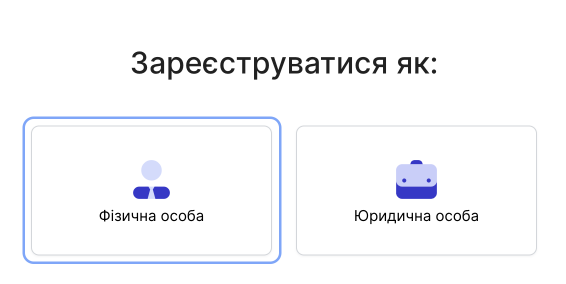
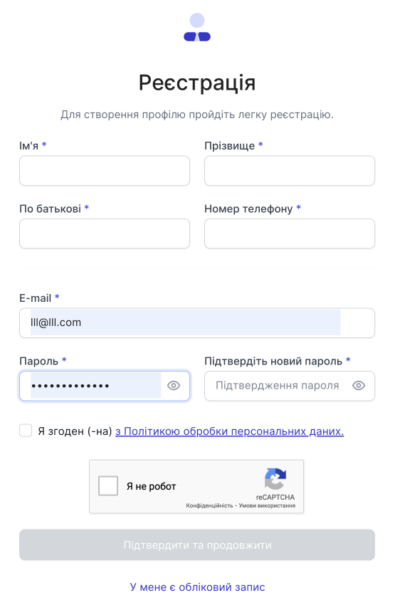

# Реєстрація фізичної особи

Щоб зареєструватися в особистому кабінеті хмарної АТС OneVOIPlanet, перейдіть на сторінку [реєстрації](https://cabinet.onevoiplanet.com/registration).

Для реєстрації як фізична особа, натисніть **Фізична особа**

Для створення облікового запису заповніть легку форму, в яку входить:
- Ім'я
- Прізвище
- По-батькові
- Номер телефону

І для подальшої авторизації, потрібно запровадити:
- E-mail
- Пароль
- Підтвердження пароля

Натисніть **Підтвердити та продовжити**.

Для повноцінної роботи хмарної АТС виконайте наступний список дій:

**Верифікація профілю**. Заповніть особисту інформацію про себе або компанію.

[Докладніше про Верифікацію профілю →](/authorization-and-verification/verification/verification-individual)

**Вибір тарифу та покупка номерів**. Ознайомтеся та визначтеся який тариф Вам підходить та виберіть номери до покупки.

[Докладніше про Вибір тарифу та покупку номерів →](/finance/control-plan)

**Налаштувати вхідний та вихідний напрям номера**. Для здійснення першого дзвінка, налаштуйте номер.

[Докладніше про Налаштування вхідного та вихідного напряму номера →](/call-processing/numbers/settings-number)