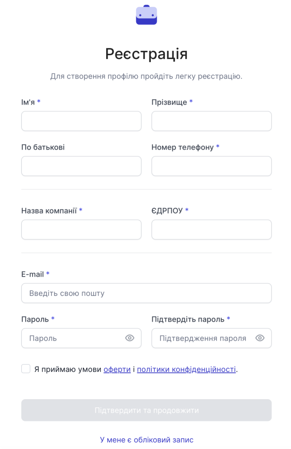

# Реєстрація юридичної особи

Для реєстрації в особистому кабінеті хмарної АТС OneVOIPlanet перейдіть на сторінку [реєстрації](https://cabinet.onevoiplanet.ua/registration).

Щоб зареєструватись як юридична особа, натисніть **Юридична особа**

Для створення облікового запису заповніть легку форму:
- Ім'я
- Прізвище
- По-батькові
- Номер телефону
- Назва компанії
- ЄДРПОУ

І для подальшої авторизації, потрібно вказати:
- E-mail
- Пароль
- Підтвердження пароля

Натисніть **Підтвердити та продовжити**.

Для повноцінної роботи хмарної АТС виконайте наступний список дій:

**Вибір тарифу та покупка номерів**. Ознайомтесь та оберіть  найзручніший для вас тариф, перейдіть до покупки номерів.

[Докладніше про Вибір тарифу та покупку номерів →](/finance/control-plan)

**Налаштування вхідного та вихідного напрямків номера**. Для здійснення першого дзвінка — налаштуйте номер.

[Докладніше про Налаштування вхідного та вихідного напряму номера →](/numbers/settings-number)
