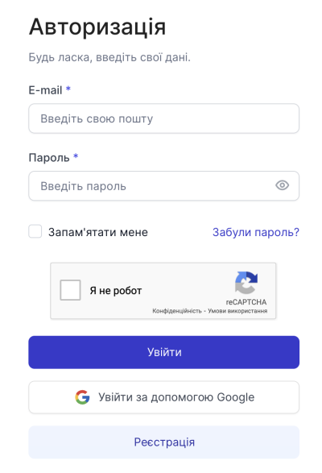
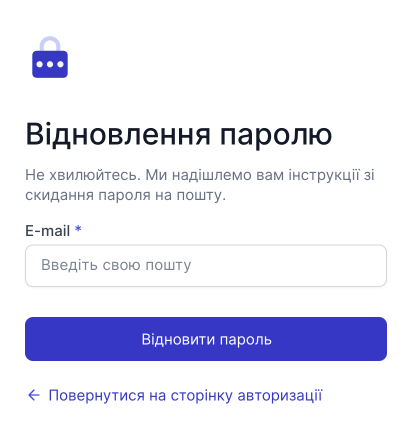
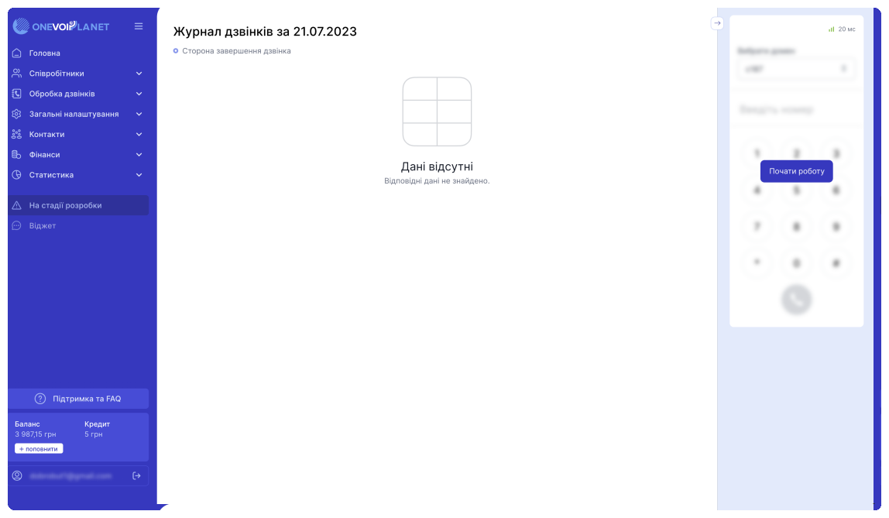

# Вхід в особистий кабінет

ЕЯкщо Ви вже є клієнтом OneVOIPlanet, перейдіть [за посиланням](https://cabinet.onevoiplanet.com/auth) для того, щоб авторизуватися в системі.

Якщо у Вас немає облікового запису в особистому кабінеті, Ви можете самостійно зареєструватися (https://cabinet.onevoiplanet.com/registration).

Форма для входу до Вашого особистого кабінету віртуальної АТС OneVOIPlanet.

1. Потім вводимо E-mail, а також пароль, вказаний вами при реєстрації;

2. Якщо Ви не знаєте чи забули пароль, натисніть "[Забули пароль?](https://cabinet.onevoiplanet.com/auth/forgot-password)". Перед Вами відкриється сторінка для відновлення пароля.

На цій сторінці, необхідно ввести Ваш E-mail, а потім натисніть "Відновити пароль", після чого на Вашу електронну адресу прийде інструкція щодо зміни пароля, за якою Ви зможете встановити новий пароль;

Після успішного входу до Вашого особистого кабінету, перед Вами відкриється сторінка Вашого особистого кабінету з навігаційним меню зліва.

Якщо Ви раніше не користувалися нашим особистим кабінетом, ознайомтеся з [покроковим налаштуванням проекту](/step-by-step-project-setup).