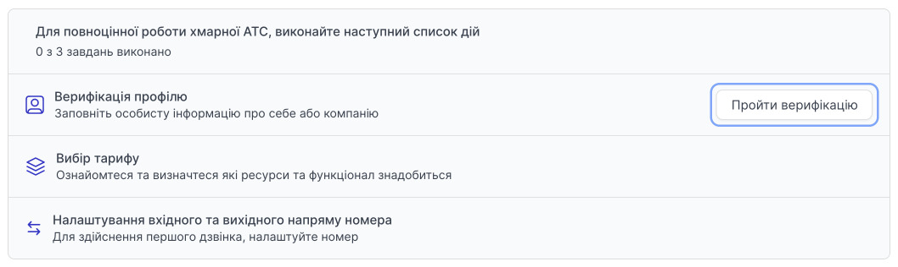
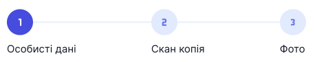

# Верифікація фізичної особи

Для повноцінної роботи хмарної АТС, потрібно верифікувати профіль. Заповнити особисту інформацію про себе або компанію.

Після реєстрації на головній сторінці особистого кабінету буде перелік дій з послідовністю виконання.

Натискаємо **Пройти верифікацію**.

Верифікація складається із трьох кроків.

- Особисті дані
- Скан копія (паспорт або ID-картка)
- Фото (особисте фото)

## Перший етап. Особисті дані

### Особисті дані

- Прізвище
- Ім'я
- По-батькові
- номер телефону (контактний номер телефону для зв'язку з власником облікового запису)
- E-mail
- Дата народження

### Місце реєстрації

- Країна
- Індекс
- Область
- Місто
- Вулиця
- Будинок
- Квартира

### Паспортні дані

Вибираємо документ **Паспорт** або **ID картка**.

Паспорт:

- Серія
- Номер
- Ким виданий
- Дата випуску

ID картка:

- Номер

Натисніть **Продовжити**.