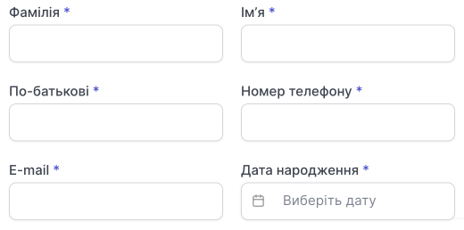
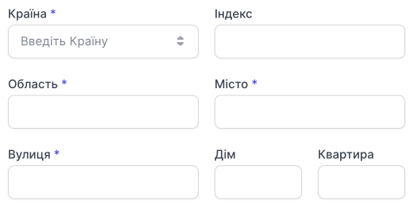
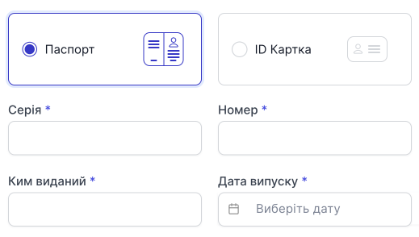
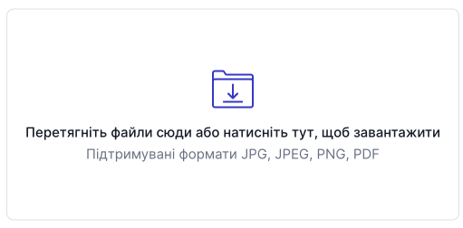
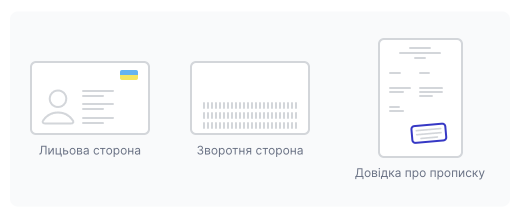
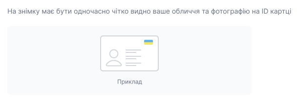
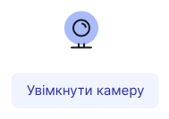
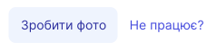
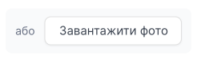
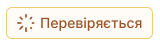

# Верифікація фізичної особи

Для повноцінної роботи хмарної АТС, потрібно верифікувати профіль. Заповнити особисту інформацію про себе або компанію.

Після реєстрації на головній сторінці особистого кабінету буде перелік дій з послідовністю виконання.

Натискаємо **Пройти верифікацію**.

Верифікація складається із трьох кроків.

- Особисті дані
- Скан копія (паспорт або ID-картка)
- Фото (особисте фото)

## Перший етап. Особисті дані

### Особисті дані

- Прізвище
- Ім'я
- По-батькові
- номер телефону (контактний номер телефону для зв'язку з власником облікового запису)
- E-mail
- Дата народження

### Місце реєстрації

- Країна
- Індекс
- Область
- Місто
- Вулиця
- Будинок
- Квартира

### Паспортні дані

Вибираємо документ **Паспорт** або **ID картка**.

**Паспорт:**

- Серія
- Номер
- Ким виданий
- Дата випуску

**ID картка:**

- Номер

Натисніть **Продовжити**.

## Другий етап. Скан-копія

### Скан-копія паспорту

Прикрепіть фото або скан-копію сторінок паспорта 1,2 та 3,4 (якщо більше 25 років), а також сторінку з пропискою.

> **Будьте уважливі!** Підтримувані формати сканів - JPG, JPEG, PNG, PDF

Для того щоб прикріпити фото перетягніть файли або натисніть на цей блок.

### Скан-копія ID картки

Прикрипіть фото або скан-копію ID картки лицьової та зворотної сторони, а також лист з пропискою.

> **Будьте уважливі!** Підтримувані формати сканів - JPG, JPEG, PNG, PDF

Для того щоб прикріпити фото перетягніть файли або натисніть на цей блок.

Натисніть **Продовжити**.

## Третій етап. Фото

На третьому етапі залежно від вибраного документа **Паспорт** чи **ID картка** зробіть фото з цим документом у руках.

Ви можете зробити фото за допомогою веб-камери на Вашому пристрої:

1. Натисніть **Увімкнути камеру**.

2. Натисніть **Зробити фото**.

Якщо камера не ввімкнулась або виникли проблеми, натисніть **Не працює?**. Вас переведе на документацію з варіантами вирішення проблеми.

Якщо у Вас немає веб-камери, ви можете завантажити фото, яке зробили заздалегідь за допомогою іншого пристрою.

3. Натисніть **Завершити верифікацію**.

**Документи надіслано на перевірку.** 

Після верифікації ваших документів нашим менеджером, Вам передзвонять протягом 24 години.