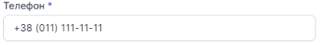

# Редагування у чорному списку

Зверніть **увагу** при редагуванні у чорному списку номер який був до редагування буде **видалений**, а номер на який редаговано буде **доданий** до чорного списку.

### Як редагувати номер у чорному списку?

1. Перейдіть до **Чорний список**

2. Натисніть на **...** біля номеру, який бажаєте редагувати

3. Натисніть на опцію **Редагувати**

4. В поле **Телефон** змініть номер на інший

5. Натсніть **Зберегти**

Номер успішно відредаговано
