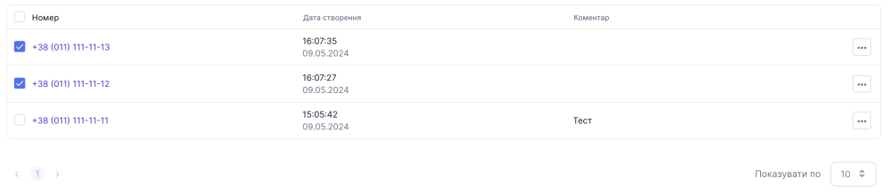

# Видалення з чорного списку

### Як видалити номер з чорного списку?

Видалити номер з чорного списку можливо трьома варіантами:

1. Додати номер у список контактів
2. Видалити один номер з таблиці чорного списку
3. Видалити одразу декілька номерів з таблиці чорного списку

### Видалення через додавання у список контактів

Після додавання номеру до списку контактів він буде автоматично видаленний з чорного списку

[Детальніше ознайомитись з додаванням номеру до списку контактів](../contacts/create-contact.md)

### Видалення одного номеру через таблицю чорного списку

1. Перейдіть до **Чорний список**

2. Натисніть на **...** біля номеру, який бажаєте видалити

3. Оберіть опцію **Видалити**

4. У модальному вікні натисніть **Видалити**

Номер успішно видалено

### Видалення одразу декількох номерів з чорного списку

1. Перейдіть до **Чорний список**

2. Оберіть через чекбокс декілька номерів

3. Біля кнопки Додати номер натисніть кнопку видалення, яка має вигляд **Корзини**

4. У модальному вікні натисніть **Видалити**

Номера успішно видалено
