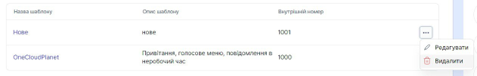
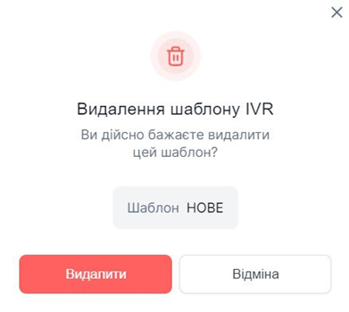

# Видалення голосового меню

###	Як видалити голосове меню?
Перед тим, як видалити голосове меню, переконайтеся, що прикріплення до вхідного напрямку номера, відключені від нього.

1.	Натисніть **Обробка дзвінків**.
 
 

2.	Перейдіть до **Голосове меню (IVR)**.
 
  

3.	Натисніть кнопку ... і виберіть пункт **Видалити**.
 
  

4.	У вікні підтвердіть дію кнопкою **Видалити**.

 
