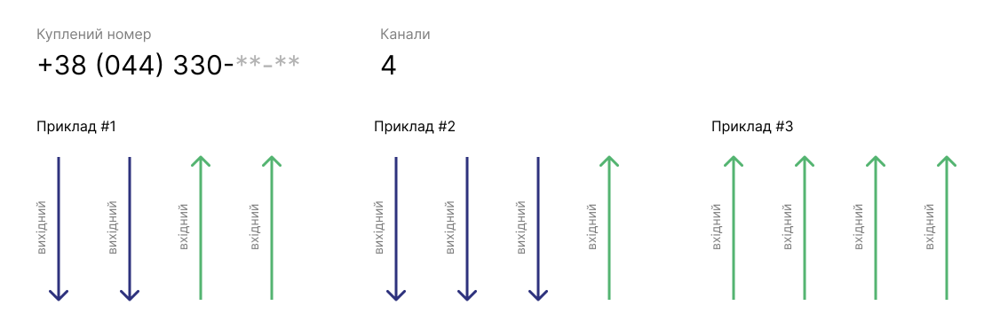

# Вартість номеру

## Категорії фільтрації номерів

Ми надаємо послуги з надання номерів:
- **Міські**
- **Мобільні**
- **0800**

Кожна з категорій має фільтрацію за ексклюзивністю номера:
- **Простий** (безкоштовні)
- **Бронзовий** (2500 грн)
- **Срібний** (5000 грн)
- **Золотий** (10000 грн)
- **Платиновий** (25000 грн)

## Як складається ціна за номер?

Кожен номер має власну вартість та щомісячну абонплату за канали цього номера.

**Канал номера** – це шлях у телефонному номері, яким проходить один дзвінок.

Мінімальна кількість каналів доступна до покупки номера складає 4. Приклад використання, на скріншоті нижче.

Ціна одного каналу - **25 грн**.

Якщо ми беремо один номер із категорії **Простий**.

Витрати на цей номер становитимуть:
- Одноразова вартість покупки номера – безкоштовно.
- Щомісячна оплата за абонплату 4 каналів – 100 грн.

Збільшуючи кількість каналів, щомісячна абонплата підвищується.

> **Будьте уважливі!** При здійсненні будь-яких фінансових операцій в особистому кабінеті OneVOIPlanet, враховуйте, що при списанні грошей йде перерахунок суми до кінця цього місяця. Наступні списання цієї операції будуть розраховані з 1 числа місяця.

