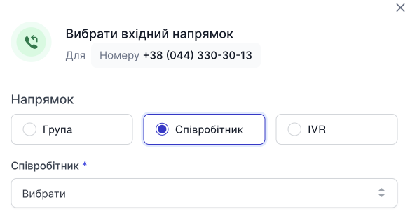
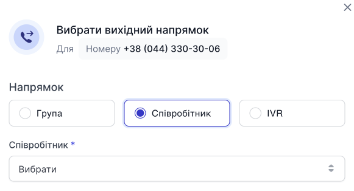

# Налаштування вхідного та вихідного напрямку номера

Після покупки номера Ви можете керувати вхідним та вихідним напрямком номера.

**0800 номер може мати тільки вхідний напрямок**.

Всі інші номери можуть мати лише один вхідний напрямок та безліч вихідних напрямків.

Вхідний та вихідний напрямок може бути:
- **Співробітник**
- **Група**
- **Голосове меню(IVR)**

## Налаштування входящего направления

1. Натисніть **Вибрати**.

2. У модальному вікні, виберіть напрямок та у списку, виберіть кого хочете призначити на вхідний напрямок.

3. Натисніть **Зберегти**.

> Увага! Ви можете змінити або видалити напрямок, при натисканні на **...**, у меню, що випадає, вибрати ту дію, яку Вам потрібно зробити.

## Налаштування исходящего направления

1. Натисніть **Вибрати**.

2. У модальному вікні, виберіть напрямок та у списку, виберіть кого хочете призначити на вихідний напрямок.

3. Натисніть **Зберегти**.

> Увага! Ви можете змінити або видалити напрямок, при натисканні на **...**, у меню, що випадає, вибрати ту дію, яку Вам потрібно зробити.

### Додавання ще одного вихідного напрямку

1. Натисніть **Додати**.

2. У модальному вікні, виберіть напрямок та у списку, виберіть кого хочете призначити на вихідний напрямок.

3. Натисніть **Зберегти**.

