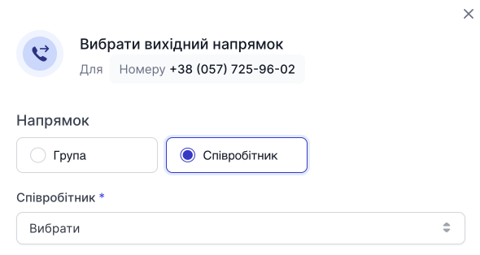

# Налаштування вхідного та вихідного напрямків номера

Після покупки номера ви можете керувати вхідним та вихідним напрямками номера.

**0800 номер може мати тільки вхідний напрямок** (тобто тільки прийняття дзвінків).

Всі інші номери можуть мати лише один вхідний напрямок (або на співробітника, або на групу, або на голосове меню) та безліч вихідних напрямків (на співробітника, групу, голосове меню).

## Налаштування вхідного напрямку

1. Натисніть **Вибрати**.

2. У модальному вікні, виберіть напрямок та у списку, виберіть кого хочете призначити на вхідний напрямок.

3. Натисніть **Зберегти**.

> Увага! Ви можете змінити або видалити напрямок, при натисканні на **...**, у меню, що випадає, вибрати ту дію, яку Вам потрібно зробити.

## Налаштування вихідного напрямку

1. Натисніть **Вибрати**.

2. У модальному вікні, виберіть напрямок та у списку, виберіть кого хочете призначити на вихідний напрямок.

3. Натисніть **Зберегти**.

> Увага! Ви можете змінити або видалити напрямок, при натисканні на **...**, у меню, що випадає, вибрати ту дію, яку Вам потрібно зробити.

### Додавання ще одного вихідного напрямку

1. Натисніть **Додати**.

2. У модальному вікні, виберіть напрямок та у списку, виберіть кого хочете призначити на вихідний напрямок.

3. Натисніть **Зберегти**.

