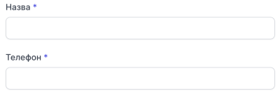

# Створення контакту

Зверніть **увагу**, що при створенні контакту з номером який знаходиться у чорному списку, цей контакт буде автоматично видалений з чорного списку.

### Як створити котнакт?

1. Перейдіть до **Контакти**

2. Натисніть **Створити котнакт**

3. В модальному вікні введіть **назву** контакту та його **номер телефону**

4. Натисніть **Додати**

Контакт успішно створено
