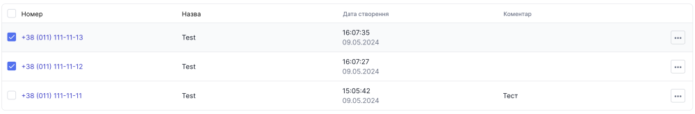

# Видалення контакту

### Як видалити контакт?

Видалити контакт можливо трьома варіантами:

1. Додати номер контакту у чорний список
2. Видалити один контакт
3. Видалити одразу декілька контактів

### Видалення контакту через додавання до чорного списку

Після додавання контакту до чорного списку він буде автоматично видаленний з списку контактів

[Детальніше ознайомитись з додаванням контакту до чорного списку](../black-list/add-to-black-list.md)

### Видалення одного контакту

1. Перейдіть до **Контакти**

2. В таблиці оберіть необхідний контакт та натсніть **...**

3. Оберіть опцію **Видалити**

4. У модальному вікні натисніть **Видалити**

### Видалення одразу декількох контактів

1. Перейдіть до **Контакти**

2. Оберіть через чекбокс декілька контактів

3. Біля кнопки Створити контакт натисніть кнопку видалення, яка має вигляд **Корзини**

4. У модальному вікні натисніть **Видалити**

Номери успішно видалено
