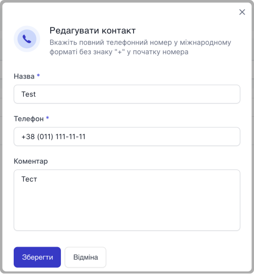

# Редагування контакту

### Як редагувати контакт?

1. Перейдіть до **Контакти**

2. В таблиці оберіть необхідний контакт та натсніть **...**

3. Оберіть опцію **Редагувати**

4. У модальному вікні відредагуйте необхідні данні

5. Натисніть **Зберегти**

Контак успішно відредаговано
