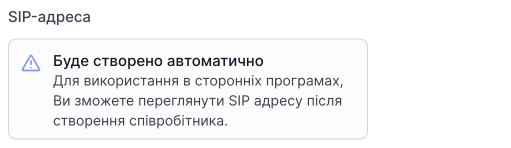
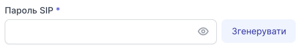
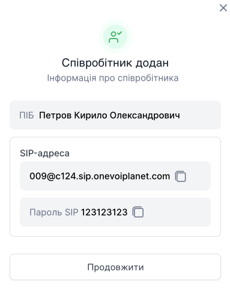

# Створення співробітника

Співробітників можна додавати до груп, прикріплювати направлення на голосове меню, здійснювати дзвінки з цього співробітника.

Кожен співробітник має власну внутрішню SIP лінію.

У кожному тарифі є обмеження на кількість доданих співробітників.

[Детальніше ознайомитися з тарифами →](https://onevoiplanet.ua/ua/plans)

## Як створити співробітника?

1. Натисніть **Співробітники**.

2. Перейдіть до **Усі співробітники компанії**.

3. Натисніть **Створити співробітника**.

Створення співробітника поділено на два етапи - **Дані співробітника** та **Налаштування облікового запису SIP**.

## Перший етап. Дані співробітника

Заповніть дані співробітника:
- Прізвище
- Ім'я
- По-батькові
- Роль співробітника
- Е-мейл
- Телефон
- Пароль

[Ознайомтеся зі списком ролей та їхніми правами →](/employees-groups/employees/roles)

E-mail та пароль будуть дані для авторизації співробітника в його особистому кабінеті.

4. Нажміть **Продовжити**.

## Другий етап. Налаштування акаунту SIP

Після створення співробітника буде автоматично згенеровано SIP-адресу співробітника, за допомогою якого можна використовувати сторонні програми для того, щоб здійснювати дзвінки.

1. Виберіть домен, у якому буде створено співробітника.

[Детальніше ознайомитися з доменами →](https://onevoiplanet.ua/ua/plans)

2. Введіть пароль SIP.

Пароль буде використовуватися для авторизації у сторонніх програмах.

3. Натисніть **Створити**.

Після створення з'явиться модальне вікно з інформацією ПІБ та SIP даними, які можна використовувати у сторонніх додатках. Ці дані Ви зможете переглянути далі в редагуванні профілю співробітника.

