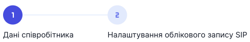

# Створення співробітника

Можливості співробітників: 
- бути доданими до груп;
- здійснювати та приймати дзвінки;
- безкоштовний зв'язок між один одним по всьому світу;
- додавати клієнтів у контакти компанії;
- писати коментарі до дзвінків та окремо до контактів;
- доступ до журналу дзвінків.

Кожен співробітник має власну внутрішню SIP-лінію.

У кожному тарифі є обмеження на кількість доданих співробітників.

[Детальніше ознайомитися з тарифами →](https://onevoiplanet.ua/uk/plans)

## Як створити співробітника?

1. Натисніть **Співробітники**.

2. Натисніть **Створити співробітника**.

Створення співробітника поділено на два етапи - **Дані співробітника** та **Налаштування облікового запису SIP**.

## Перший етап. Дані співробітника

Заповніть дані співробітника:
- Прізвище
- Ім'я
- По-батькові
- Роль співробітника
- Е-мейл
- Телефон
- Пароль

[Ознайомтеся зі списком ролей та їхніми правами →](roles.md)

E-mail та пароль потрібні для авторизації співробітника в його особистому кабінеті.

4. Нажміть **Продовжити**.

## Другий етап. Налаштування акаунту SIP

Після створення співробітника буде автоматично згенеровано його SIP-адресу, за допомогою якої можна використовувати сторонні програми чи додатки для здійснення дзвінків.

1. Виберіть домен, у якому буде створено співробітника.

[Детальніше ознайомитися з доменами →](../../sip-settings/sip-domains/create-sip-domain.md)

2. Введіть пароль SIP.

Пароль буде використовуватися для авторизації у сторонніх програмах.

3. Натисніть **Створити**.

Після створення з'явиться вікно з інформацією ПІБ та SIP-даними, які можна використовувати в сторонніх програмах та додатках. В подальшому ці дані ви зможете переглянути в редагуванні профілю співробітника Обліковий запис SIP.

