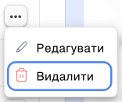
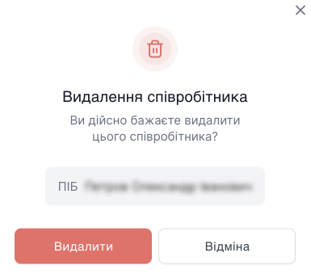
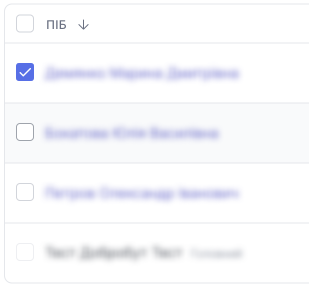
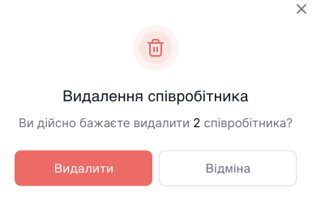

# Видалення співробітника

Перед тим, як видалити співробітника, переконайтеся, що всі залежності відключені від нього.

- Співробітник прикріплений до групи.
- Співробітник прикріплений до вхідного чи вихідного напрямку номера.
- Співробітник прикріплено до IVR (голосового меню).

Від'яжіть від залежності і Ви зможете видалити співробітника.

## Як видалити одного співробітника?

1. Натисніть **Співробітники**.

2. Перейдіть до **Усі співробітники компанії**.

3. Натисніть кнопку **...**

4. Натисніть **Видалити**.

5. У модальному вікні підтвердьте дію кнопкою **Видалити**.

## Як видалити кілька співробітників?

1. Натисніть **Співробітники**.

2. Перейдіть до **Усі співробітники компанії**.

3. Перейдіть до кількох або всіх доданих співробітників.

4. Натисніть кнопку **Видалити**.

5. У модальному вікні підтвердьте дію кнопкою **Видалити**.

