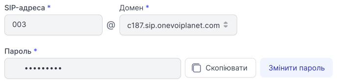

# Редагування співробітника

## Як редагувати співробітника?

1. Нажміть **Співробітники**.

2. Перейдіть до **Усі співробітники компанії**.

3. Натисніть на ПІБ співробітника або натисніть кнопку **...** і виберіть пункт **Редагувати**.

## Особисті дані

Ви можете редагувати усі особисті дані співробітника з роллю нижче **Адміністратора**.

## Обліковий запис SIP

SIP адресу та домен співробітника неможливо змінити.

Пароль можна **Скопіювати** та **Змінити пароль**.

4. Щоб зберегти дані, натисніть **Зберігти**.

