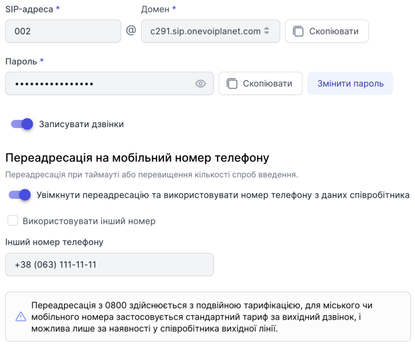

# Редагування співробітника

### Як редагувати співробітника?

1. Нажміть **Співробітники**.

2. Натисніть на ПІБ співробітника або натисніть кнопку **...** і виберіть пункт **Редагувати**.

### Особисті дані

Ви можете редагувати усі особисті дані співробітника з роллю нижче **Адміністратора**.

### Обліковий запис SIP

SIP-адресу та домен співробітника неможливо змінити.

- Пароль можна **Скопіювати** та **Змінити пароль**.

- Ви можете увімкнути або вимкнути запис дзвінків для обраного співробітника.

- Увімкнути або вимкнути **переадресацію на мобільний номер телефону** та змінити номер для переадресації

Щоб зберегти дані, натисніть **Зберегти**.

