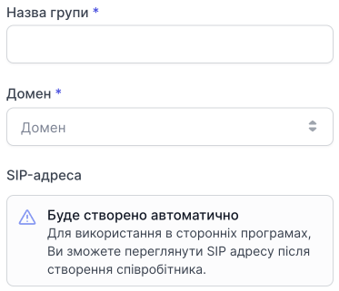
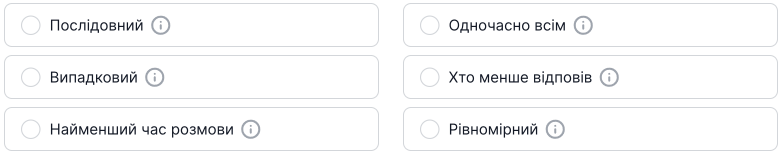
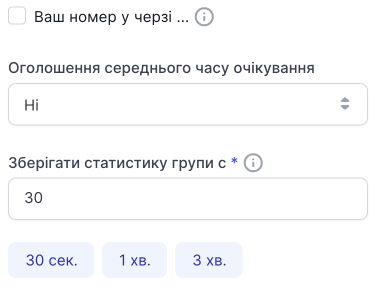
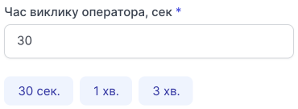
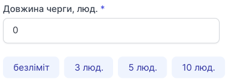
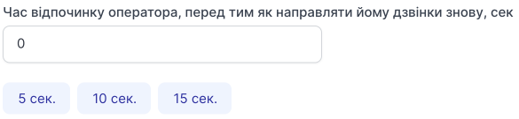
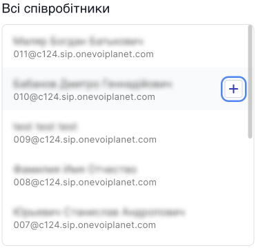

# Створення групи

## Як створити групу?

1. Перейдіть до **Групи**.

2. Натисніть **Створити групу**.

Створення групи складається із трьох кроків.

- Налаштування виклику
- Налаштування утримання
- Співробітники

## Перший етап. Налаштування виклику

### Налаштування виклику

- Назва групи
- Домен
- SIP-адреса буде створено автоматично

### Алгорітм розподілення дзвінків у групі

[Детальніше ознайомитися з алгоритмами →](algorithm-group.md)

### Під час очікування клієнтом відповіді оператора

- Ваш номер у черзі (визначте, чи потрібно для клієнта програвати голосовий файл з номером у черзі під час очікування підключення оператора)

- Оголошення середнього часу очікування (чи потрібно повідомляти клієнта, який середній час очікування оператора)

- Оновлення статистики групи через кожні (використовується системою для визначення оператора при виборі алгоритму дзвінка)

Натисніть **Продовжити**.

## Другий етап. Налаштування утримання

### Налаштування утримання

- **Час виклику оператора**

Визначте, скільки часу клієнт буде підключатись до оператора, перед тим, як виклик буде переведено на наступного оператора.

Ви можете вибрати заготовлені варіанти чи вписати свій.

- **Довжина черги**

Визначте довжину черги, після якого у людей на лінії відбуватиметься скидання.

0 – це безліміт. Скидання не буде.

Ви можете вибрати заготовлені варіанти чи вписати свій.

- **Інтервал між спробами виклику операторів**

Визначте який інтервал буде між спробами виклику операторів. (Час, який матиме оператор, щоб відповісти на дзвінок.)

Ви можете вибрати заготовлені варіанти чи вписати свій.

- **Час відпочинку оператора, перед тим як направляти йому дзвінки знову**

Визначте час відпочинку оператора, перш ніж надсилати йому дзвінки знову.

Ви можете вибрати заготовлені варіанти чи вписати свій.

### Мелодії та звукові сповіщення

- **Мелодія "Під час очікування з'єднання з оператором"**

Ви можете вибрати музичний файл або голосовий файл, який буде програватися абоненту під час очікування на з'єднання з оператором.

## Третій етап. Співробітники

### Додавання співробітників до групи

Для того, щоб додати співробітника/співробітників до групи:

1. Натисніть **Додати співробітників**.

2. Виберіть співробітника/співробітників у списку **Всі співробітники** якого хочете додати, наведіть курсор на нього та натисніть кнопку **+**.

Після натискання кнопки **+** співробітника буде перенесено до правого списку **Додані співробітники**.

Щоб додати всіх співробітників до цієї групи, натисніть кнопку **Додати всіх**.

Щоб видалити всіх вибраних співробітників із доданих до цієї групи, натисніть кнопку **Видалити всіх**.

3. Натисніть **Зберегти**, щоб зберегти список доданих співробітників.

Натисніть **Зберегти налаштування**, щоб створити групу.

