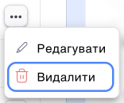

# Видалення групи

Перед тим, як видалити групу переконайтеся, що всі прикріплення відключені від неї, а саме:

- до вхідного чи вихідного напрямку номера.
- до IVR (голосового меню).

Відключіть від всіх прикріплень і тоді ви зможете видалити групу.

## Як видалити групу?

1. Нажміть **Співробітники**.

2. Перейдіть до **Групи співробітників**.

3. Натисніть кнопку **...**

4. Натисніть **Видалити**.

5. У модальному вікні підтвердіть дію кнопкою **Видалити**.

