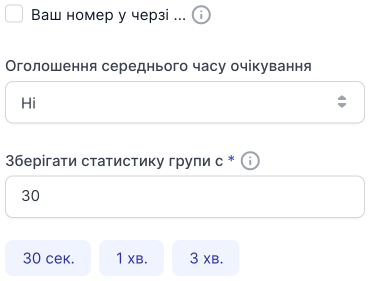
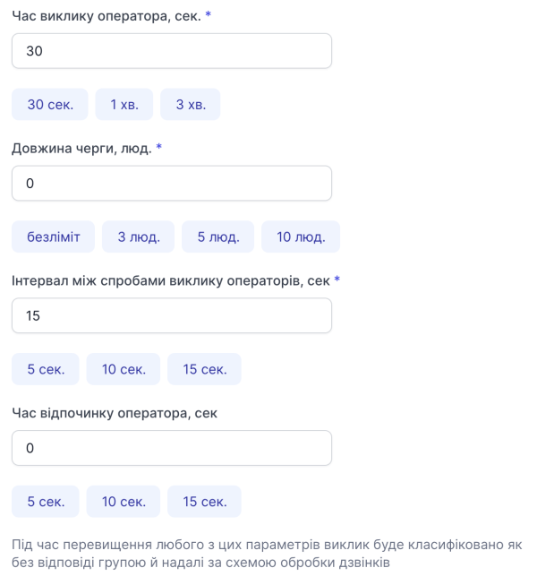
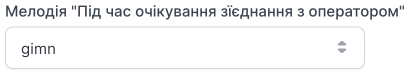

# Редагування групи

### Як редагувати групу?

1. Перейдіть до **Групи**.

2. Натисніть на назву групи або натисніть кнопку **...** і виберіть пункт **Редагувати**.

### Налаштування виклику

Ви можете редагувати назву групи.

Змінити SIP-адресу та домен групи неможливо.

### Алгоритм розподілу дзвінків у групі

Ви можете змінити алгоритм розподілу дзвінків у групі.

[Детальніше ознайомитися з алгоритмами →](algorithm-group.md)

### Під час очікування до відповіді оператора

Усі пункти можливі для редагування.

### Налаштування утримання

Усі пункти можливі для редагування.

### Мелодії та звукові сповіщення

Усі пункти можливі для редагування.

### Співробітники

Редагування послідовності можливе за умови обраного алгоритму розподілу дзвінків **Послідовний**.

Щоб видалити співробітників із групи, натисніть кнопку **Видалити**.

Після внесення всіх змін натисніть **Зберігти налаштування**.

