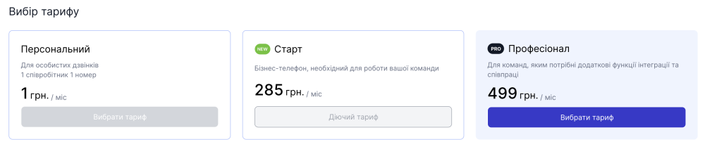

# Управління тарифом

### Як переглянути детальну інформацію про мій тариф?

1. Для перегляду детальної інформації про Ваш тариф перейдіть до **Фінанси**

2. Натисніть **Мій тариф**

3. На сторінці **Мій тариф** Ви маєте змогу дізнатись про такі данні:

   - Назва тарифу, його ціну, та до якої дати він оплачен
   - Послуги які входять до тарифу
   - Ваші орендовані номери, ціну абонплати кожного номера, кількість каналів кожного номера та суму абонплати за ці номери
   - Список Ваших додаткових послуг, ціну абонплати за кожну додаткову послугу та суму абонплати за додаткові послуги
   - Підсумкова вартість абонплати

### Як змінти тариф?

Зверніть **увагу**, що тариф можливо змінити тільки на один з наступних після діючого. Для переходу на більш простий тариф від діючого необхідно звернутись до [техпідтримки →](https://t.me/OneVOIPlanet_Manager)

1. Перейдіть на сторінку [Мій тариф](#як-переглянути-детальну-інформацію-про-мій-тариф)
2. Натисніть **Змінити тариф**

3. Оберіть тариф на який бажаєте перейти та переконайтесь, що на балансі достатньо коштів

4. Натисніть **Зберігти**

Якщо на балансі достатньо коштів, тариф буде змінено через декілька хвилин
