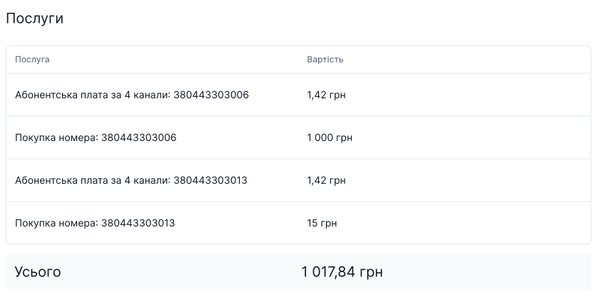

# Витрати

Здійснюючи покупки в особистому кабінеті, на сторінці **Витрати** буде відображено весь список витрат за вибраний період часу.

Спочатку відображається інформація за **Поточний місяць**. Але ви можете вибрати один день або необхідний для вас період.

У сусідньому блоці відображається сума витрат за вибраний період.

У таблиці Ви можете спостерігати назву замовлення, суму, дату замовлення та платіжну систему.

Щоб подивитися, що входить у замовлення натисніть **назву замовлення**.

У замовленні буде відображено назву послуг та їх вартість та підсумок за це замовлення.

