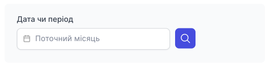

# Поповнення

Здійснюючи поповнення в особистому кабінеті, на сторінці **Поповнення** відображатиметься весь список поповнень за вибраний період часу.

Спочатку відображається інформація за **Поточний місяць**. Але ви можете вибрати один день або необхідний для вас період.

У сусідньому блоці відображається сума поповнень за вибраний період.

У таблиці Ви можете побачити назву замовлення, суму, спосіб поповнення, дату замовлення та статус.

