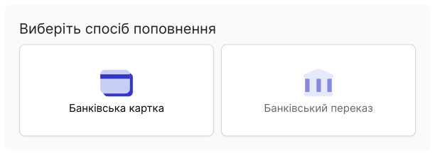
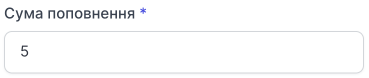
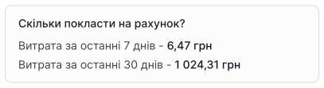
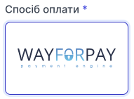

# Банківська картка

Щоб поповнити рахунок компанії банківською карткою:

1. У лівому сайдбарі натисніть кнопку **Поповнити**.

2. Виберіть метод оплати
- Банківська картка
- Банківський переказ

3. Вкажіть, на яку суму ви хочете поповнити рахунок.

Щоб орієнтуватися на яку суму варто поповнити рахунок, Ви можете побачити витрати за останні 7 днів та витрати за останні 30 днів.

4. Виберіть спосіб оплати.

5. Натисніть **Поповнити**.

