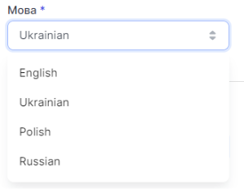

# Мовні налаштування

Доступні мови інтерфейсу:

- Англійська
- Українська
- Польська
- Російська

### Як змінити мову інтерфейсу?

1. Перейдіть до **Загальні налаштування** (кнопка має вигляд шестерні)

2. У випадаючому списку **Мова** оберіть необхідну мову

3. Натисніть **Зберегти**

Мову успішно змінено
