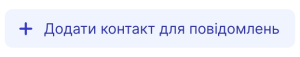
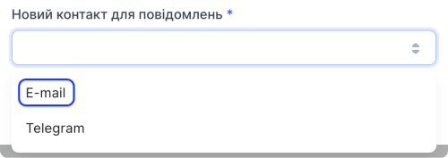
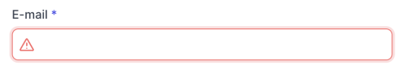
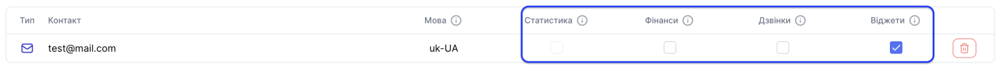
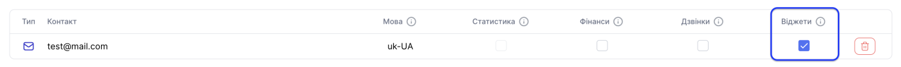
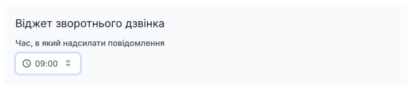

# Налаштування E-mail нотифікацій

Для E-mail доступні такі нотифікації:

1. Нотифікація про усі відкладені заявки на віджет зворотного дзвінка за добу

### Як додати E-mail для отримання нотифікацій?

1. Авторизуватися в особистому кабінеті

[Детальніше про те, як авторизуватись в особистому кабінеті →](../../authorization-and-verification/sign-in.md)

2. Перейдіть до **Загальні налаштування** (кнопка має вигляд шестерні)

3. Натисніть на **Додати контакт для повідомлень**

4. У випадаючому меню **Новий контакт для повідомлень** оберіть **E-mail**

5. В поле **E-mail** введіть електронну адресу почтової скриньки на яку бажаєте отримувати нотифікації

6. Натисніть **Додати**

7. Оберіть в таблиці контактів нотифікації, які бажаєте отримувати на обранний контакт

Зверніть **увагу** що для деяких нотифікацій необхідно зробити додаткові налаштування

8. Натисніть **Зберегти**

E-mail для отримання нотифікацій успішно доданий.

### Налаштування нотифікацій про усі відкладені заявки на віджет зворотного дзвінка за добу

1. В таблиці контактів оберіть **Віджети** для необхідного контакту

2. Оберіть час в який бажаєте отримувати нотифікацію на E-mail про усі відкладені заявки на віджет зворотного дзвінка за добу

3. Натисніть **Зберегти**

