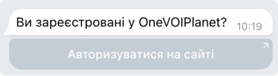
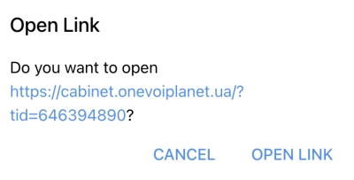

# Налаштування Телеграм повідомлень

Зверніть **увагу**, що додавати та налаштовувати контакт має можливість лише Власник компанії та Супервайзер

Для Телеграм доступні такі повідомлення:

1. Повідомлення про нову відкладену заявку на віджет зворотного дзвінка

2. Повідомлення про пропущений виклик

3. Повідомлення про деактивацію компанії

### Як додати Телеграм для отримання повідомлень?

1. Авторизуватися в особистому кабінеті

[Детальніше про те, як авторизуватись в особистому кабінеті →](../../authorization-and-verification/sign-in.md)

2. Перейдіть до **Загальні налаштування** (кнопка має вигляд шестерні)

3. Натисніть на **Додати контакт для повідомлень**

4. У випадаючому меню **Новий контакт для повідомлень** оберіть **Telegram**

5. Перейдіть (Ви або Ваш співробітник) за посиланням для авторизації у телеграм боті

6. Натисніть **Open in web** або **Send message**

7. Натисніть у верхній частині чату **Start**

8. Оберіть мову

9. Натисніть **Авторизуватись на сайті**

10. Натисніть **Open Link**

11. Після переходу за посиланням відкриється особистий кабінет або сторінка авторизації

[Детальніше про те, як авторизуватись →](../../authorization-and-verification/sign-in.md)

12. Для налаштування повідомлень перейдіть до **загальних налаштувань**

13. Оберіть необхідні повідомлення

14. Натисніть **Зберегти**

Телеграм контакт успішно доданий.

### Налаштування повідомлень про нову відкладену заявку на віджет зворотного дзвінка

1. В таблиці контактів оберіть **Віджети** для необхідного контакту

2. Натисніть **Зберегти**

Тепер цей контакт буде отримувати повідомлення про кожну нову відкладену заявку на віджет зворотного дзвінка.

### Налаштування повідомлень про пропущений виклик

1. В таблиці контактів оберіть **Дзвінки** для необхідного контакту

2. Натисніть **Зберегти**

Тепер цей контакт буде отримувати повідомлення про усі свої пропущенні виклики.

### Налаштування повідомлень про деактивацію компанії

1. В таблиці контактів оберіть **Фінанси** для необхідного контакту

2. Натисніть **Зберегти**

Тепер цей контакт буде отримувати повідомлення про деактивацію компанії.
