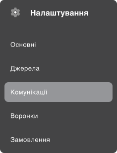
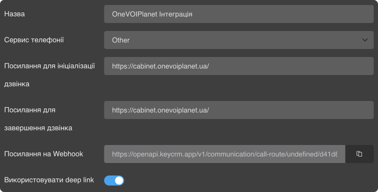
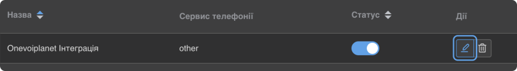
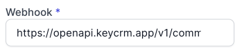

# Інтеграція з KeyCRM

**KeyCRM** - українська CRM-система, що буде корисна будь-якому підприємцю (послуги, ecommerce, контакт-центри/онлайн-консультації, сфера краси і здоров'я), так як автоматизує процеси, що є майже у кожному бізнесі: 
- Комунікацію з клієнтами у месенджерах, соцмережах, по телефону, Email тощо;
- Збір та обробку запитів (лідів), замовлень, записів на послугу з будь-яких джерел: сайти, сторінки Instagram, чати, інтернет-магазини та маркетплейси;
- Роботу з воронками продажів, угод, проектів;
- Аналітику та звітність щодо різних аспектів бізнесу, у тому числі по: фінансам, продажам, каналам (чатам), воронкам, ефективності менеджерів та багато іншого;

### Можливості інтеграції
- Журнал дзвінків (всі вхідні та вихідні дзвінки у картці заявці).
- Прослуховування аудіозапису дзвінка у CRM.
- Відстеження пропущених викликів.

### Налаштування інтеграції з KeyCRM
Для налаштування інтеграції KeyCRM з OneVOIPlanet, необхідно:

1. Натисніть **Інтеграції**.

2. Перейдіть до **KeyCRM**.

3. Активуйте інтеграцію.

4. В полі Webhook, введіть ключ webhook до API KeyCRM, який дозволяє ідентифікувати KeyCRM обліковий запис. [Як згенерувати API Ключ?](integration-KeyCRM#як-згенерувати-api-ключ)

5. Натисніть **Зберегти**.

### Як згенерувати API ключ?

1. Перейдіть до кабінету KeyCRM.

2. Натисніть **Налаштування**.

3. Перейдіть до **Комунікації**.

4. Перейдіть до таби **Телефонія**.

5. Натисніть на кнопку **Додати нову службу**.

6. На сторінці створення, введіть назву, наприклад OneVOIPlanet Інтеграція.

7. У полі **Сервіс телефонії** оберіть сервіс **Other**.

8. У поля Посилання для ініціалізації дзвінка та Посилання для завершення дзвінка введіть посилання на кабінет телефонії https://cabinet.onevoiplanet.ua

9. Увімкнить опцію **deep link**.

10. Натисніть на кнопку **Додати**.

11. Додайте необхідну кількість співробітників, внутрішній номер (наприклад: 000domainc000), та оберіть менеджера до якого буде відноситись цей внутрішній номер.

12. Натисніть на кнопку **Додати**.

Номери SIP акаунтів знайдіть у особистому кабінеті OneVOIPlanet у розділі **Співробітники**.

Беремо номер SIP акаунту співробітника (менеджера), та додаємо domain назву вашого домена. Виходить 001domainc001.

13. Натисніть на кнопку **Додати**.

14. Оновіть сторінку.

15. Настисніть на кнопку редагування інтеграції.

16. Скопіюйте посилання на Webhook.

17. Вставити посилання на Webhook у вашому кабінеті OneVOIPlanet.

18. Натиснути кнопку **Зберегти**.

**Інтеграцію успішно налаштовано.**
