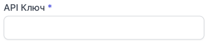
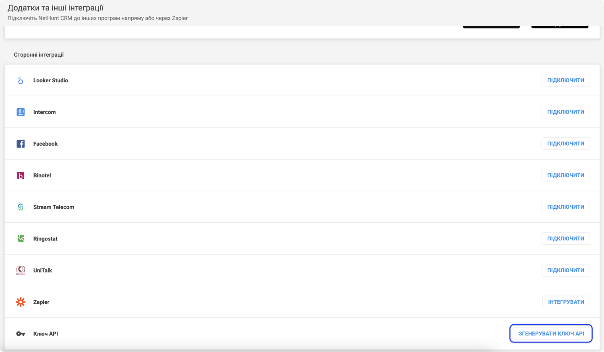

# Інтеграція з NetHunt

**NetHunt** - організація бази даних, воронка продажу, автоматизація бізнес-процесів, задачі та контроль за ефективністю команди — все в одній СRM системі.
Найкращий вибір для В2В компаній.

### Можливості інтеграції
- Журнал дзвінків (всі вхідні та вихідні дзвінки).
- Прослуховування аудіозапису дзвінка у CRM.
- Відстеження пропущених викликів.
- Автоматично створюється контакт після завершення дзвінка.
- Історія дзвінків контактів.

### Налаштування інтеграції з NetHunt

Для налаштування інтеграції NetHunt з OneVOIPlanet, необхідно:

1. Натисніть **Інтеграції**.

2. Перейдіть до **NetHunt**.

3. Активуйте інтеграцію.

4. В полі **E-mail**, введіть пошту на яку зареєстровано кабінет у NetHunt. (Наприклад: `nethunt@onevoiplanet.me`).

5. В полі **API Ключ** потрібно ввести згенерований ключ (токен), який дозволяє ідентифікувати NetHunt обліковий запис.
   [Як згенерувати API Ключ?](integration-nethunt#як-згенерувати-api-ключ)

6. Натисніть **Зберегти**.

Після налаштування інтеграції в NetHunt автоматично згенеруються усі необхідні теки для взаємодії з дзвінками.

### Як згенерувати API Ключ?

1. Перейдіть до кабінету NetHunt.
2. Натисніть **Налаштування**.

3. У розділі **Інтеграції** оберіть **Додатки та інші інтеграції**

4. Натисніть **Згенерувати Ключ API**

5. API-ключ потрібен на етапі налаштування в особистому кабінеті OneVOIPlanet.
