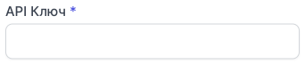

# Інтеграція з SalesDrive

**SalesDrive** - українська CRM-система для інтернет-магазинів, заснована 2012 року.

SalesDrive автоматизує обробку замовлень, створення та відстеження статусів ТТН, облік складу. SalesDrive фіксує комунікації з клієнтом (дзвінки, SMS, месенджери, email) і допомагає контролювати роботу менеджерів.

### Можливості інтеграції
- Журнал дзвінків (всі вхідні та вихідні дзвінки у картці заявці).
- Прослуховування аудіозапису дзвінка у CRM.
- Відстеження пропущених викликів.
- Дзвінок в 1 клік з картки заявки.

### Налаштування інтеграції з CRM SalesDrive
Для налаштування інтеграції SalesDrive з OneVOIPlanet, необхідно:

1. Натисніть **Інтеграції**.

2. Перейдіть до **SalesDrive**.

3. Активуйте інтеграцію.

4. В полі **Домен**, введіть лінк сформований у кабінеті SalesDrive. (Наприклад: onevoiplanet.salesdrive.me).

5. В полі **API Ключ** потрібно ввести згенерований ключ (токен), який дозволяє ідентифікувати SalesDrive обліковий запис.
[Як згенерувати API Ключ?](integration-sales-drive#як-згенерувати-api-ключ)

6. Натисніть **Зберегти**.

7. Наступне, це налаштувати внутрішні номери у кабінеті SalesDrive.
[Як настроїти внутрішні номери?](integration-sales-drive#внутрішні-номери)

### Як згенерувати API Ключ?

1. Перейдіть до кабінету SalesDrive. 
2. Натисніть **Установки**.

3. Перейдіть до **Загальні налаштування і інтеграції**.

4. Перейдіть до таби **Інші сервіси**.

5. Та натискаємо на **API**.

6. Натисніть на кнопку **API-ключі**.

7. Натисніть на кнопку **Створити API-ключ**.

8. На сторінці створення, введіть назву, наприклад OneVOIPlanet Інтеграція.

9. Надайте доступ до декільких пунктів:

    a. Заявки: додавання, редагування, читання.
    
    b. Статуси заявки: читання.
    
    c. Дзвінки: додавання та редагування.
    
    d. Дані контакту за номером телефона: читання.

10. Натисніть **Зберегти**.

11. Після створення, вам згенерується API-ключ, котрий нам потрібен на етапі налаштування в особистому кабінеті OneVOIPlanet.

### Внутрішні номери
Вкажіть внутрішні номери для кожного менеджера у розділі **Телефонія** загальних налаштувань SalesDrive.

У полі **Внутрішній номер** слід вказувати номер SIP-акаунту OneVOIPlanet.

Наприклад: 000domainc000

Номери SIP-акаунтів знайдіть у особистому кабінеті OneVOIPlanet натисніть **Співробітники**.

Беремо номер SIP акаунту співробітника (менеджера), та додаємо **domain** назву вашого домена. Та в нас виходить 000domainc261.

Для додавання декільких співробітників (менеджерів), спочатку додайте менеджерів в SalesDrive, та після того, введіть внутрішні лінії до кожного менеджера.

**Інтеграцію успішно налаштовано**.
