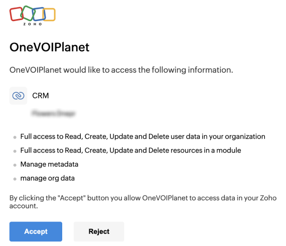

# Інтеграція з ZohoCRM

**ZohoCRM** - допомагає взаємодіяти з потенційними та наявними клієнтами, отримувати цінну інформацію про ваш бізнес, створювати масштабовані процеси продажів і швидше розвивати компанію.

### Можливості інтеграції
- Журнал дзвінків (всі вхідні та вихідні дзвінки).
- Прослуховування аудіозапису дзвінка у CRM.
- Відстеження пропущених викликів.
- Автоматично створюється контакт після завершення дзвінка.

### Налаштування інтеграції з ZohoCRM

Для налаштування інтеграції ZohoCRM з OneVOIPlanet, необхідно:

1. Авторизуватись у [особистому кабінеті](https://www.zoho.com/crm/) ZohoCRM

2. Перейти до особистого кабінету OneVOIPlanet

3. Натисніть **Інтеграції**.

4. Перейдіть до **ZohoCRM**.

5. Натисніть **Підключити**

6. У відкритому вікні натисніть **Accept**

7. Після підключення Вас автоматично поверне до особистого кабінету OneVOIPlanet
