# Створення голосового меню

Перед тим, як створити голосове меню (IVR), переконайтеся, що додані музичні та голосові файли.

**Музичні файли.** Мелодії, які чує клієнт перед зʼєднанням з оператором.  [Детальніше ознайомитися з музичними файлами](/docs/audio-files/music-files/add-music-file.md)

**Голосові файли.** Голосовий аудіозапис, який чує клієнт, звернувшись до Вас.  [Детальніше ознайомитися з голосовими файлами](/docs/audio-files/voice-files/add-voice-file.md)

## Як створити голосове меню?
1. Натисніть **Обробка дзвінків**.

2. Перейдіть до **Голосове меню (IVR)**.

3. Натисніть **Створити шаблон IVR**.

#### Створення шаблону IVR поділено на два етапи. На першому етапі Ви налаштовуєте загальні параметри голосового меню.
1. Придумайте та введіть назву голосового меню.

2. Виберіть домен, у якому буде створено голосове меню.

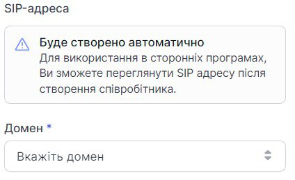

3. За необхідності додайте опис голосового меню.

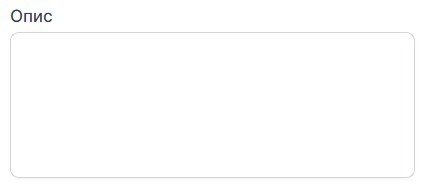

4. Налаштування утримання
	
    При роботі з IVR-меню: у разі, якщо не було введено жодних даних (номер пункту меню тощо) протягом заданого інтервалу очікування введення даних, користувач буде перенаправлений виходячи з відповідного налаштування.

    Наприклад, клієнт не обрав номер пункту меню (не натиснув жодну кнопку) протягом часу, який ви вказали в **Час очікування, сек.** (не менше 3 сек). Тоді він почує **Аудіо перевищення очікування**, якщо ви його оберете.
    Вкажіть час (в секундах), протягом якого система буде очікувати вибір клієнта (натискання кнопки номера пункту меню).

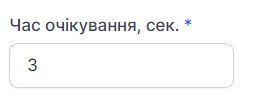

Якщо клієнт протягом цього часу нічого не обрав, ви можете налаштувати **Аудіо перевищення очікування**.

5. При роботі з IVR-меню: перевищено вказану кількість помилок (спроб ввести відсутній номер пункту меню) під час введення номера пункту меню.
Наприклад, клієнт обрав відсутній номер пункту меню (натиснув цифру “6”, хоча в голосовому меню тільки 3 пункти меню: цифри “1”, “2”, “3”). Кількість спроб невірного введення Ви обираєте в **Кількість спроб введення** (не менше 3).

Далі Вам необхідно обрати **Аудіо неправильного висновку**, яке клієнт почує при невірній спробі введення номеру пункту меню.

Також Ви можете обрати **Аудіо перевищення спроб введення**, яке клієнт почує після перевищення кількості спроб введення.

6. Переадресація.
	Переадресація при таймауті або перевищення кількості спроб введення. Тобто в цьому пункті Ви обираєте дію, яка відбудеться, якщо клієнт нічого не обере в голосовому меню або перевищить кількість спроб невірного введення.
	Ви можете обрати одну з трьох дій:
    - завершити виклик;
    - вибрати співробітника, на якого буде переведений виклик;
    - вибрати групу, на яку буде переведений виклик.

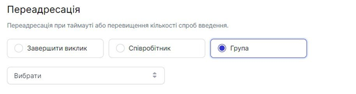
    
   Повернення в меню. 
   Для повернення до попереднього розділу голосового меню (IVR) в системі використовується клавіша “*” (зірочка).

7. Натисніть **Зберегти**.

На другому етапі Ви обираєте часовий діапазон, голосові файли для вітання та опису меню. 
Можна встановити голосове меню для робочого та неробочого часу Вашої компанії або цілодобове.

## Для робочого та неробочого часу

1. Натисніть **Робочий час**.

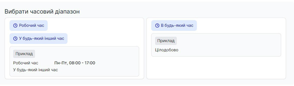

2.	Визначте робочий час.
	Після визначення часу для годинного діапазону “Робочий час” автоматично підрахується часовий діапазон “У будь-який інший час”.

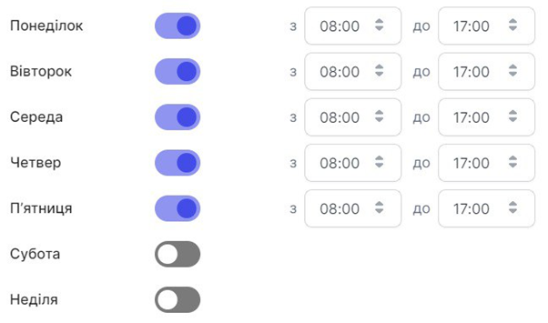

Ви можете обрати робочі дні тижня та час початку та закінчення робочого дня.

3.	Натисніть **Зберегти**.

 

4.	Натисніть **Вибрати голосовий файл** для робочого часу.

 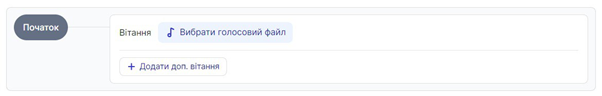

За необхідності Ви можете додати ще вітання. Для цього натисніть **+ Додати доп.вітання**.

5.	Виберіть потрібний Вам файл.

 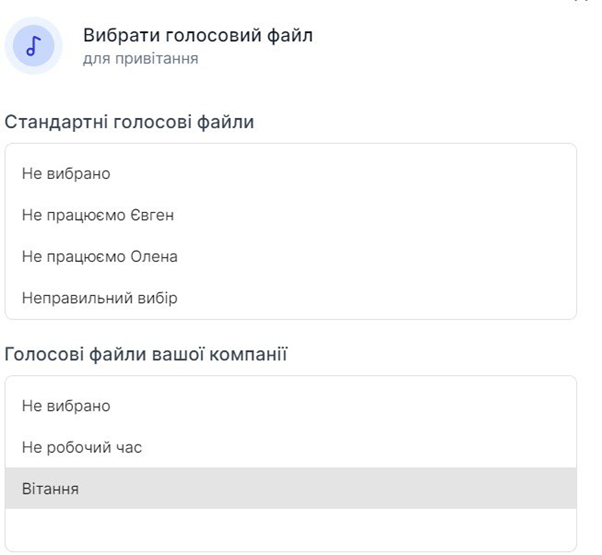

6.	Натисніть **Зберегти**.

 

7.	Натисніть **Вибрати голосовий файл** для робочого часу.
 
 

8.	Виберіть потрібний Вам файл.

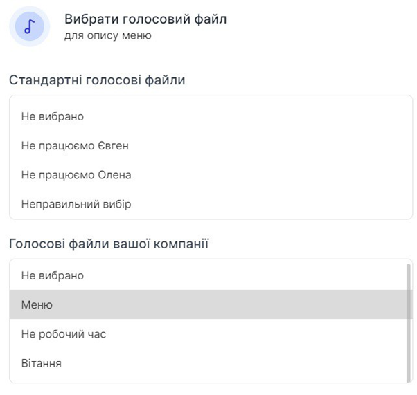
 
9.	Натисніть **Зберегти**.

 
10.	Для створення пунктів меню натисніть **+ Пункт меню**.
 

11.	Далі Вам необхідно вибрати дію на цей пункт меню - або клієнт прослухає певну інформацію (**Голосовий файл**), або клієнт буде переадресований на групу, співробітника чи дзвінок буде завершено.
 

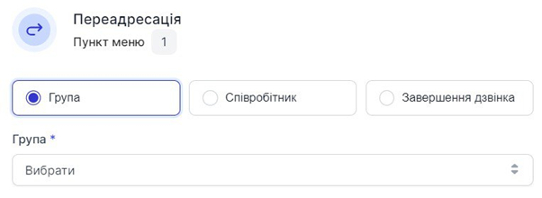
 
12.	Натисніть **Зберегти**.
 

13.	Таким чином Ви можете додати до девʼяти пунктів меню.

14.	За необхідності до кожного пункту меню можна додати до девʼяти підпунктів меню. Для цього натисніть **+ Підпункт**.
 

15.	Далі Вам необхідно вибрати дію на цей пункт меню - або клієнт прослухає певну інформацію (**Голосовий файл**), або клієнт буде переадресований на групу, співробітника чи дзвінок буде завершено.
 

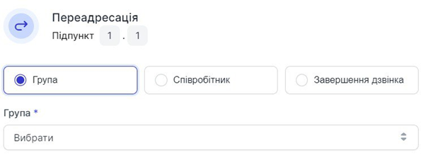
 
16.	Натисніть **Зберегти**.

 
17.	Після того, як Ви додали всі необхідні пункти та підпункти меню, у верхньому правому куті **Редагування голосового меню** натисніть **Зберегти голосове меню**.
 

18.	Для налаштування голосового меню в неробочий час натисніть **У будь-який інший час**.
 
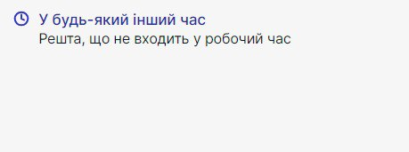

Подальші налаштування ті ж самі, що і для робочого часу.

**Цілодобове голосове меню**
Підходить для компаній, які працюють цілодобово 7 днів на тиждень.

Натисніть **Будь-який час**.
 
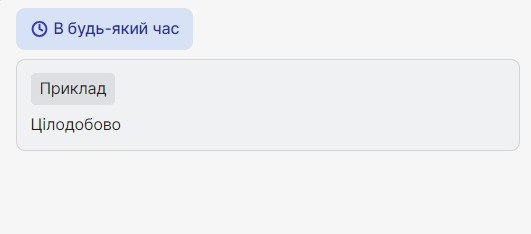

Подальші налаштування ті ж самі, що і для робочого часу.
