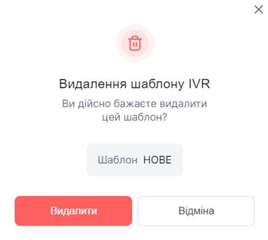

# Видалення голосового меню

###	Як видалити голосове меню?

Перед тим, як видалити голосове меню, переконайтеся, що прикріплення до вхідного напрямку номера, відключені від нього.

1. Перейдіть до **Голосове меню (IVR)**.
 
  

2. Натисніть кнопку ... і виберіть пункт **Видалити**.
 
  

3. У модальному вікні натиснути **Видалити**.

 
