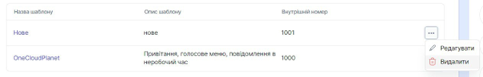

# Редагування голосового меню

### Як редагувати голосове меню?

1. Перейдіть до **Голосове меню (IVR)**.
 
 

2. Натисніть кнопку ... і виберіть пункт **Редагувати**. 
 
 

3. Ви можете редагувати:
-	Назву шаблону;
-	Опис;
-	Час очікування;
-	Аудіо перевищення очікування;
-	Кількість спроб введення;
-	Аудіо неправильного висновку;
-	Аудіо перевищення спроб введення;
-	Переадресацію;
-	Часовий діапазон;
-	Голосові файли;
-	Дію на пункт/підпункт меню.

SIP-адресу та домен голосового меню неможливо змінити.

4. Щоб зберегти дані, натисніть **Зберегти**.
 

