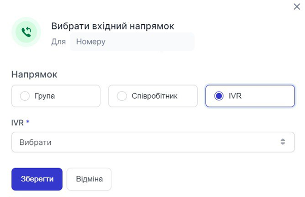

# Налаштування голосового меню

### Як прикріпити голосове меню на вхідний напрямок?
1.	Натисніть **Обробка дзвінків**.

 

2.	Перейдіть до **Номери**.
 
 

3.	Натисніть **Вибрати** в стовпчику **Вхідний напрямок**.
 
 
 
4.	Оберіть **IVR**, який бажаєте призначити на вхідний напрямок обраного номеру.
 
 
 
5.	Натисніть **Зберегти**.
 
 
