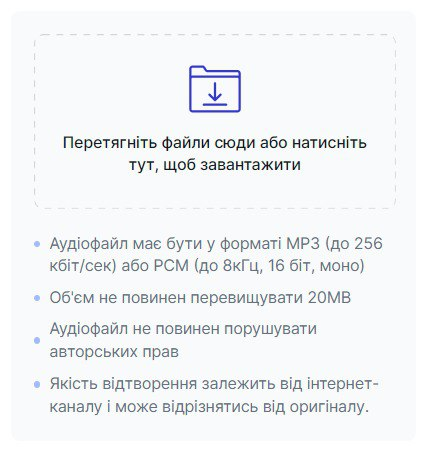

# Додати музичний файл

Музичні файли — це мелодії, які чує клієнт перед зʼєднанням з оператором.

Музичні файли можна додати лише на групу. Групу можна створити з одного співробітника.   [Детальніше ознайомитися з групами](docs/employees-groups/groups/create-group.md)
	
### Як додати музичний файл?
1.	Натисніть **Загальні налаштування**.
 
 

2.	Перейдіть до **Музичні файли**.
 
 

3.	Натисніть **Додати музичний файл**.
 
 

4.	Придумайте та введіть назву музичного файлу.
 
 

5.	Перетягніть музичний файл або натисніть на вікно завантаження.
 
 
 
**Будьте уважні!** Музичний файл має бути у форматі мр3 або рсм. Обʼєм файлу не повинен перевищувати 20 мб.

6.	Натисніть **Зберегти**.

 
