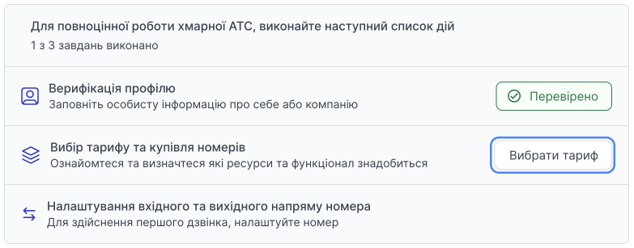
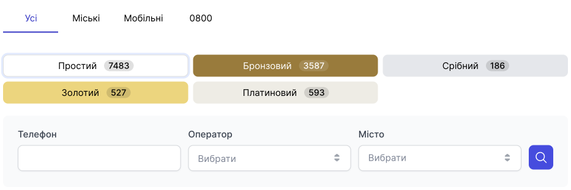
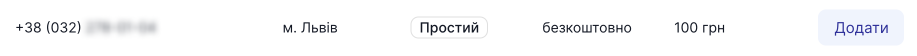
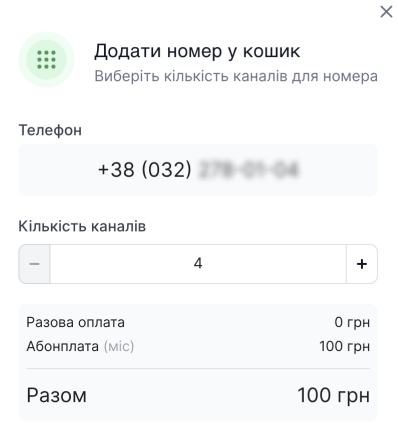
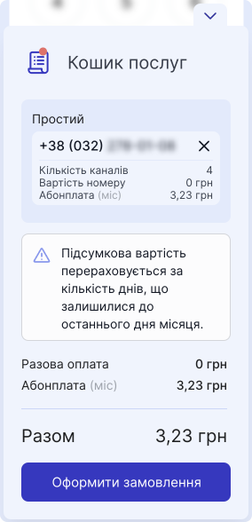
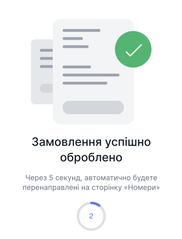

# Покупка номера

Після реєстрації профілю, вам доступні до покупки номери, до яких можна підв'язати вхідний та вихідний напрямки.

> **Будьте уважні!** Номери 0800 доступні лише для вхідного напрямку.

Перед покупкою номера переконайтеся, що у вас достатньо коштів для придбання.

## Як купити номер після реєстрації?

[Докладніше про початкове налаштування →](/step-by-step-project-setup)

## Як докупити ще номер в особистому кабінеті?

1. Перейдіть до **Номерів**.

2. Натисніть **Додати номер**. 

3. Виберіть номер, який хочете придбати. Для зручності ви можете фільтрувати пошук за: категоріями, ексклюзивністю, числами, операторами та містом.

[Докладніше про ціну номерів та абонплати →](price-number.md)

4. Вибираємо номер телефону та натискаємо кнопку **Додати**.

5. У модальному вікні виберіть кількість каналів цього номера.

> Канал номера – це шлях у телефонному номері, по якому проходить один дзвінок.
>
> Мінімальна кількість каналів для покупки номера складає:
> - Міські - 4
> - 0800 - 100
> - Мобільні - 1

6. Натисніть **Додати**.

7. У кошику послуг з'явився номер(-и), який ви обрали.

> Увага! Підсумкова вартість номера та каналів прораховується за кількість днів, що залишилися до останнього дня поточного місяця.

8. Натисніть **Оформити замовлення**.

Якщо у вас вистачає коштів для покупки номера та каналів — транзакція буде успішною і ви відразу зможете налаштувати [вхідний та вихідний напрям](/numbers/settings-number) і почати здійснювати дзвінки.

Якщо недостатньо коштів для покупки номера чи каналів, вам буде запропоновано [поповнити рахунок](/finance/refill/bank-card).