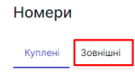
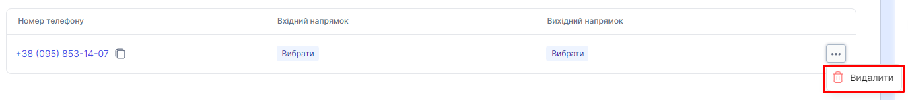

# Видалення зовнішнього номеру

## Як видалити зовнішный номер?

1. Перейдіть до **Номерів**.

2. Натиснути на вкладку **Зовнішні**

Натисніть на кнопку ... і виберіть пункт **Видалити**

3. В модальному окні натисніть **Видалити**

