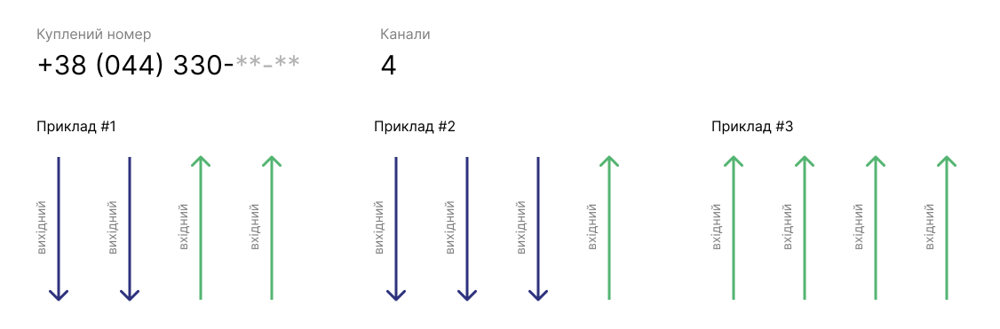

# Вартість номеру

## Категорії фільтрації номерів

Ми надаємо такі види номерів:
- **Міські**
- **Мобільні**
- **0800**

Кожна з категорій має фільтрацію за ексклюзивністю номера:
- **Простий** (безкоштовно)
- **Бронзовий** (1000 грн)
- **Срібний** (25000 грн)
- **Золотий** (5000 грн)
- **Платиновий** (15000 грн)

## Як формується ціна за номер?

Кожен номер має власну вартість та щомісячну абонплату за канали.

**Канал номера** – це шлях у телефонному номері, по якому проходить один дзвінок.

Мінімальна кількість каналів для покупки номера складає:

- **Міські** - 4
- **0800** - 100
- **Мобільні** - 1

Приклад використання наведено нижче.

Ціна одного каналу:

- **Міські** - 25 грн
- **0800** - 1 грн
- **Мобільні** - 40 грн

Якщо ми беремо один **Міський** номер із категорії **Простий**.

Витрати на цей номер становитимуть:
- Одноразова вартість покупки номера – безкоштовно.
- Щомісячна оплата за 4 канали – 100 грн.

Збільшуючи кількість каналів, щомісячна абонплата підвищується.

> **Будьте уважні!** При здійсненні будь-яких фінансових операцій в особистому кабінеті OneVOIPlanet, враховуйте, що буде перерахунок суми за кількість днів, що залишилися до останнього дня поточного місяця. Наступні списання будуть розраховані з 1 числа місяця.

