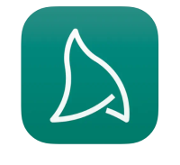
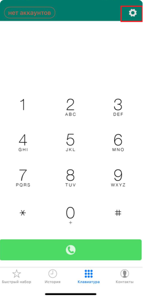
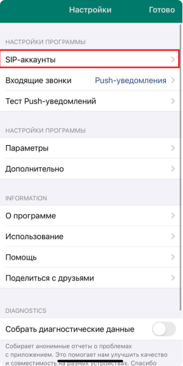
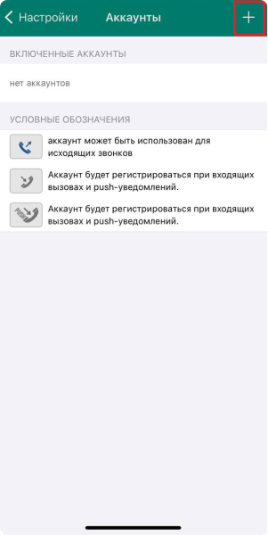
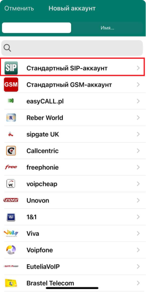
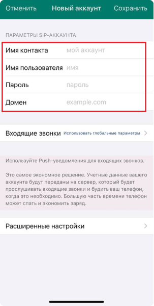
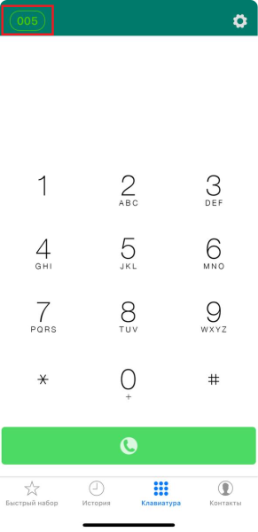

# Налаштування програми Acrobits Softphone на IOS

Налаштування софтфону Acrobits Softphone на оперативну систему IOS мобільного телефону.

У App Store необхідно завантажити додаток, який називається [Acrobits Softphone](https://apps.apple.com/ua/app/acrobits-softphone/id314192799?l=ru). Одноразова вартість 7,99$.

Для того, щоб ввести дані для реєстрації в додатку Acrobits Softphone необхідно зайти в особистий кабінет OneVOIPlanet. 

[Докладніше про Вхід в особистий кабінет →](../authorization-and-verification/sign-in.md)

В особистому кабінеті потрібно перйти до **Облікового запису SIP** співробітника.

[Докладніше про Обліковий запис SIP →](../employees-groups/employees/edit-employee.md#обліковий-запис-sip)

В додатку Acrobits Softphone:

1. Підтвердіть дозвіл на доступ усіх запитів. Після підтвердження, у верхньому правому куті натисніть **Налаштування**.

2. Оберіть **SIP-аккаунты**.

3. Натисніть у верхньому правому куті знак **+**.

4. Оберіть **Стандартный SIP-аккаунт**.

5. Заповніть рядки згідно з інформацією співробітника з особистого кабінету.

   **Имя контакту** - це SIP-адреса (005, наприклад)

   **Имя користувача** -  це SIP-адреса (005, наприклад)

   **Пароль** - це Пароль з Облікового запису SIP. Для цього необхідно натиснути Скопіювати та вставити в будь-яке вільне місце, щоб переглянути.

   **Домен** - це Домен (c333.sip.onevoiplanet.com, наприклад)

Після заповнення виділених червоним рядків натисніть зелену кнопку **Сохранить**.

6. Для того, щоб перевірити активність статусу натисніть внизу **Клавиатура**. **Зелений овал** свідчить про те, що додаток налаштовано вірно, можна приймати та здійснювати дзвінки.

