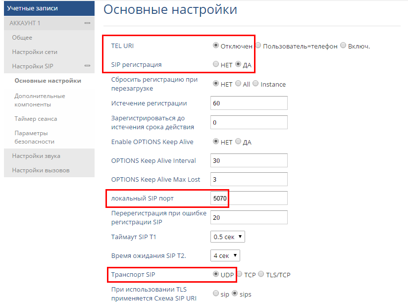
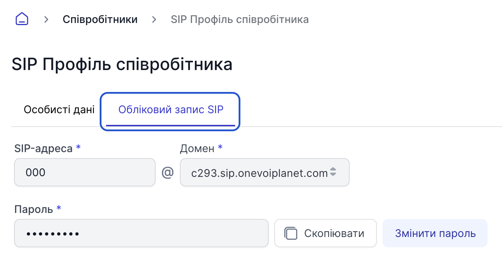

# Налаштування SIP телефону Grandstream GXP1610

Grandstream GXP1610 – це простий у використанні IP-телефон для малих та середніх підприємств або домашніх офісів.

## Як знайти IP-адресу вашого телефону

Перед тим, як розпочати налаштування, що знаходиться у веб-інтерфейсі браузера, необхідно підключити апарат до мережі інтернет і перевірити IP адресу телефону. За замовчуванням він отримує ip-адресу за DHCP (автоматичне отримання IP-адреси).

 > **ВАЖЛИВО!** Телефон і комп'ютер повинні знаходитися в одній локальній мережі.

1. Натисніть центральну кнопку на “джостику” телефону **Menu**.

2. Зайдіть у підменю Стан **(Status)**.

3. Виберіть Стан мережі **(Network status)** -> **IPv4** і ви побачите IP адресу SIP телефону.
Якщо у вас використовується мережа зі статичною IP-адресою, перейдіть в «Налаштування статичного IP» і вкажіть параметри вашої мережі (IP-адреса, яка буде виділена телефону, маску, шлюз і DNS).

4. Отриману IP-адресу необхідно ввести в командному рядку вашого браузера і перейти на сторінку авторизації. Введіть логін та пароль, за умовчанням в обох випадках це **admin***.

## Налаштування SIP телефону

1. Після переходу в інтерфейс телефону потрібно буде вибрати **Мережа - Стандартний**, внести налаштування та зберегти:

- Протокол Internet - Переважно IPv4;
- IPv4-адреса - DHCP.

2. Далі, потрібно вказати STUN-сервер та порт. Перейдіть до розділу **Налаштування** - **Загальне**:

сервер STUN - stun.l.google.com:19302

3. Додатково виберіть **Облікові записи** - **Акаунт 1** - **Налаштування мережі**:

Прокид NAT: STUN;
Необхідність використання проксі - stun.l.google.com:19302

4. Далі потрібно додати налаштування для реєстрації SIP облікового запису.

Виберіть **Облікові записи** - **Акаунт 1** - **налаштування SIP** - **Основні налаштування**:

- TEL URI - відключено;
- SIP реєстрація - ТАК;
- локальний SIP-порт – 5070;
- Транспорт SIP – UDP;

5. Після внесення настройок мережі, можна приступити до додавання параметрів для реєстрації SIP облікового запису.
Потрібно перейти **Облікові записи** - **Акаунт 1** - **Загальне** та заповнити вказані поля:

- Аккаунт активний - Так;
- Ім'я облікового запису – OneVOIPlanet PBX;
- SIP сервер – SIP домен, який вказан у налаштуваннях співробітника (наприклад: c1.sip.onevoiplanet.com);
- SIP User ID – адреса SIP облікового запису;
- Аутентифікаційний ID – адреса SIP облікового запису;
- Пароль - Пароль;
- Ім'я – адреса SIP облікового запису;

> Цю інформацію ви можете взяти у налаштуваннях співробітника.

6. Після використання цих налаштувань телефон повинен зареєструватися на АТС OneVOIPlanet.