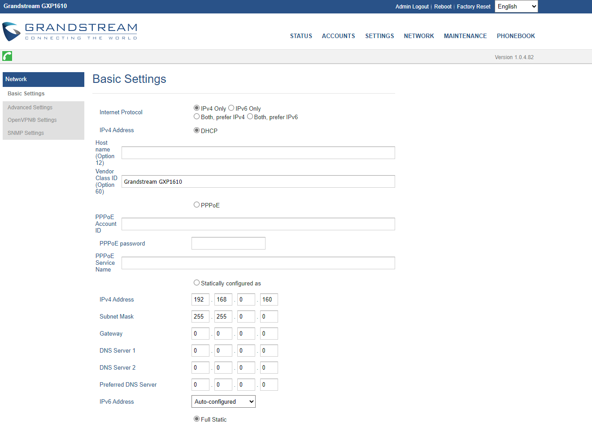

# Налаштування SIP телефону Grandstream GXP1610

Grandstream GXP1610 – це простий у використанні IP-телефон для малих та середніх підприємств або домашніх офісів.

## Як знайти IP-адресу вашого телефону

Перед тим, як розпочати налаштування, що знаходиться у веб-інтерфейсі браузера, необхідно підключити апарат до мережі інтернет і перевірити IP адресу телефону. За замовчуванням він отримує ip-адресу за DHCP (автоматичне отримання IP-адреси).

 > **ВАЖЛИВО!** Телефон і комп'ютер повинні знаходитися в одній локальній мережі.

1. Натисніть центральну кнопку на “джостику” телефону **Menu**.

2. Зайдіть у підменю Стан **(Status)**.

3. Виберіть Стан мережі **(Network status)** -> **IPv4** і ви побачите IP адресу SIP телефону.
Якщо у вас використовується мережа зі статичною IP-адресою, перейдіть в «Налаштування статичного IP» і вкажіть параметри вашої мережі (IP-адреса, яка буде виділена телефону, маску, шлюз і DNS).

4. Отриману IP-адресу необхідно ввести в командному рядку вашого браузера і перейти на сторінку авторизації. Введіть логін та пароль, за умовчанням в обох випадках це **admin***.

## Налаштування SIP телефону

1. Після переходу в інтерфейс телефону потрібно буде вибрати **Network - Basic Settings**, внести налаштування та зберегти:

- Протокол Internet - Переважно IPv4;
- IPv4-адреса - DHCP.

2. Далі, потрібно вказати STUN-сервер та порт. Перейдіть до розділу **Settings** - **General Settings**:

сервер STUN - stun.l.google.com:19302

3. Додатково виберіть **Accounts** - **Account 1** - **Network settings**:

- DNS Mode: A Record;
- Primary IP: 1.1.1.1;
- Backup IP 1: 1.1.0.0;
- Прокид NAT: STUN;
- Необхідність використання проксі - stun.l.google.com:19302

4. Після внесення настройок мережі, можна приступити до додавання параметрів для реєстрації SIP облікового запису.
Потрібно перейти **Облікові записи** - **Акаунт 1** - **Загальне** та заповнити вказані поля:

- Аккаунт активний - Так;
- Ім'я облікового запису – адрес SIP облікового запису;
- SIP сервер – SIP домен, який вказан у налаштуваннях співробітника (наприклад: c1.sip.onevoiplanet.com:5070);

> **Важливо!** Пропишіть порт 5070 для підключення у UDP.

- SIP User ID – адреса SIP облікового запису;
- Пароль - Пароль SIP;
- Ім'я – адреса SIP облікового запису + SIP сервер.

> **Наприклад** 004@c265.dev-sip.onevoiplanet.com

> Цю інформацію ви можете взяти у налаштуваннях співробітника.

5. Після використання цих налаштувань телефон повинен зареєструватися на АТС OneVOIPlanet.