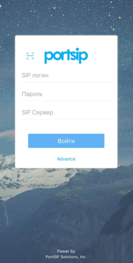

# Налаштування програми PortSIP

- [Налаштування програми PortSIP на Android](docs/sip-clients/settings-portSIP.md#налаштування-програми-portsip-на-android)

- [Налаштування програми PortSIP на IOS](docs/sip-clients/settings-portSIP.md#налаштування-програми-portsip-на-ios)

## Налаштування програми PortSIP на Android

Налаштування софтфону PortSIP на оперативну систему Android мобільного телефону.

У Goolge Play необхідно завантажити додаток, який називається PortSIP Softphone. 

Для того, щоб ввести дані для реєстрації в додатку PortSIP необхідно зайти в особистий кабінет OneVOIPlanet. 

1.	Натисніть **Співробітники**.

2. Натисніть на ПІБ співробітника або натисніть кнопку ... і виберіть пункт **Редагувати**.

3. Виберіть **Обліковий запис SIP** та відкриються дані співробітника: SIP-адреса, домен та пароль.

4. В першому рядку **Username** вказуємо дані співробітника з Облікового запису SIP,  а саме SIP-адресу. Наприклад, 003.   В другому рядку **Password** вказуємо пароль з Облікового запису SIP. Для цього необхідно натиснути **Скопіювати** та вставити в будь-яку вільну строку, щоб переглянути.   В третьому рядку **SIP Domain** вказуємо Домен та без пробілу **:5070** або **:5071**.

5. Після заповнення натисніть **Sign in**.

6. Активність статусу вказано блакитним кольором у лівому куті.   

### Налаштування фонового режиму в PortSIP на оперативну систему Android мобільного телефону

Для того, щоб налаштувати роботу софтфону PortSIP у фоновому режимі  необхідно зайти у додаток.

1. Натисніть **Settings (Настройки)**.

2. Перейдіть **Advanced (Продвинутый)**.

3. В самому низі виберіть **Battery usage**.

4. Виберіть **Дозволити (Разрешить)**.

Після цього софтфон PortSIP працює в фоновому режимі.

## Налаштування програми PortSIP на IOS

Налаштування софтфону PortSIP на оперативну систему IOS мобільного телефону.

У App Store необхідно завантажити додаток, який називається PortSIP Softphone. 

Для того, щоб ввести дані для реєстрації в додатку PortSIP необхідно зайти в особистий кабінет OneVOIPlanet. 

1.	Натисніть **Співробітники**.

2. Натисніть на ПІБ співробітника або натисніть кнопку ... і виберіть пункт **Редагувати**.

3. Виберіть **Обліковий запис SIP** та відкриються дані співробітника: SIP-адреса, домен та пароль.

4. В першому рядку **SIP логин** вказуємо дані співробітника з Облікового запису SIP,  а саме SIP-адресу. Наприклад, 003.   В другому рядку **Пароль** вказуємо пароль з Облікового запису SIP. Для цього необхідно натиснути **Скопіювати** та вставити в будь-яку вільну строку, щоб переглянути.   В третьому рядку **SIP Сервер** вказуємо Домен та без пробілу **:5070** або **5071**.

5. Після заповнення натисніть **Войти**.

6. Активність статусу вказано білим кольором зверху.

