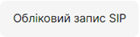

# Налаштування програми PortSIP

## Налаштування програми PortSIP на Android

Налаштування софтфону PortSIP на оперативну систему Android мобільного телефону.

У Goolge Play необхідно завантажити додаток, який називається PortSIP Softphone. 

Для того, щоб ввести дані для реєстрації в додатку PortSIP необхідно зайти в особистий кабінет OneVOIPlanet. 

1.	Натисніть **Співробітники**.

2.	Перейдіть **Усі співробітники компанії**.

3.	Натисніть на ПІБ співробітника або натисніть кнопку ... і виберіть пункт **Редагувати**.

4.	Виберіть **Обліковий запис SIP** та відкриються дані співробітника: SIP-адреса, домен та пароль.

5.	В першому рядку **Username** вказуємо дані співробітника з Облікового запису SIP,  а саме SIP-адресу. Наприклад, 003.   В другому рядку **Password** вказуємо пароль з Облікового запису SIP. Для цього необхідно натиснути **Скопіювати** та вставити в будь-яку вільну строку, щоб переглянути.   В третьому рядку **SIP Domain** вказуємо Домен та без пробілу **:5070**.

6.	Після заповнення натисніть **Sign in**.

7.	Активність статусу вказано блакитним кольором у лівому куті.   

## Налаштування програми PortSIP на IOS

Налаштування софтфону PortSIP на оперативну систему IOS мобільного телефону.

У App Store необхідно завантажити додаток, який називається PortSIP Softphone. 

Для того, щоб ввести дані для реєстрації в додатку PortSIP необхідно зайти в особистий кабінет OneVOIPlanet. 

1.	Натисніть **Співробітники**.

2.	Перейдіть **Усі співробітники компанії**.

3.	Натисніть на ПІБ співробітника або натисніть кнопку ... і виберіть пункт **Редагувати**.

4.	Виберіть **Обліковий запис SIP** та відкриються дані співробітника: SIP-адреса, домен та пароль.

5.	В першому рядку **SIP логин** вказуємо дані співробітника з Облікового запису SIP,  а саме SIP-адресу. Наприклад, 003.   В другому рядку **Пароль** вказуємо пароль з Облікового запису SIP. Для цього необхідно натиснути **Скопіювати** та вставити в будь-яку вільну строку, щоб переглянути.   В третьому рядку **SIP Сервер** вказуємо Домен та без пробілу **:5070**.

6.	Після заповнення натисніть **Войти**.

7. Активність статусу вказано білим кольором зверху.

