# Налаштування програми Zoiper

- [Налаштування програми Zoiper на Android](docs/sip-clients/settings-zoiper.md#налаштування-програми-zoiper-на-android)

- [Налаштування програми Zoiper на IOS](docs/sip-clients/settings-zoiper.md#налаштування-програми-zoiper-на-ios)

## Налаштування програми Zoiper на Android

Налаштування софтфону Zoiper на оперативну систему Android мобільного телефону.

У Goolge Play необхідно завантажити додаток, який називається Zoiper або Zoiper IAX SIP VOIP Softphone, без слів Pro. 

Для того, щоб ввести дані для реєстрації в додатку Zoiper необхідно зайти в особистий кабінет OneVOIPlanet. 

1. Натисніть **Співробітники**.

2. Натисніть на ПІБ співробітника або натисніть кнопку ... і виберіть пункт **Редагувати**.

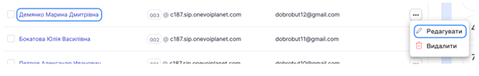

3. Виберіть **Обліковий запис SIP** та відкриються дані співробітника: SIP-адреса, домен та пароль.

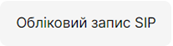

4. В першому рядку **Username@ PBX / VoIP provider** вказуємо дані співробітника з Облікового запису SIP. SIP-адресу, домен та без пробілу **:5070** або **:5071**.   В другому рядку вказуємо пароль з Облікового запису SIP. Для цього необхідно натиснути **Скопіювати** та вставити в будь-яку вільну строку, щоб переглянути. 

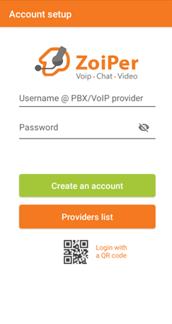
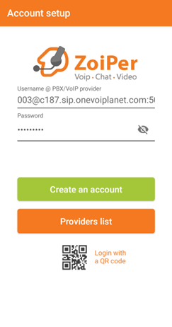

5. Після заповнення даних натисніть зелену клавішу **Create an account**.

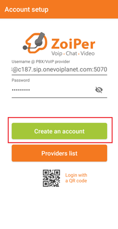

6. Далі нічого не змінюйте та натисніть **Next**.

7. Нічого не вказуємо, натисніть **Пропустити**.

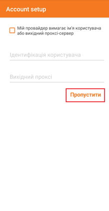

8. Оберіть SIP TCP та натисніть **Кінець**.

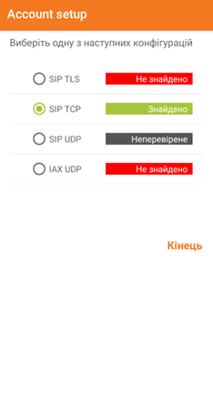

9.  Далі надаємо дозвіл здійснювати дзвінки. Натисніть Дозволити.

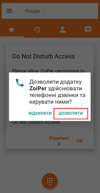

10. Надаємо дозвіл, щоб поступали дзвінки, якщо зайшли в інші додатки. Натисніть **ОК**, а потім **Дозволити**.

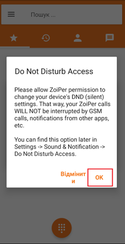

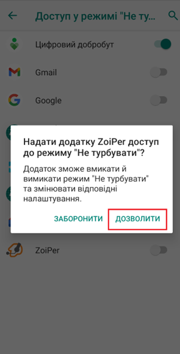

11. Дозволяємо збільшене використання батареї. Натисніть **ОК**.

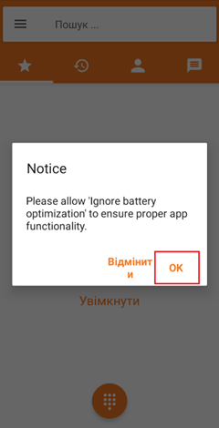

12. Дозволяємо працювати додатку в фоновому режимі. Натисніть **Дозволити**.

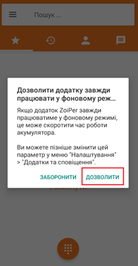

13. Обов’язково надаємо доступ до контактів. Натисніть **Увімкнути**, а потім **Дозволити**. 

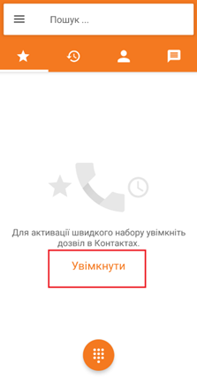

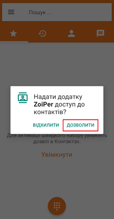

14. При необхідності дозволяємо записувати дзвінки, або відхиляємо, якщо не потрібно. 

15. Для того, щоб перевірити активність статусу натиснить у верхньому лівому куті три горизонтальні лінії. Якщо вказано **Обліковий запис готовий** — це свідчить про те, що додаток налаштовано вірно, можна приймати та здійснювати дзвінки.  

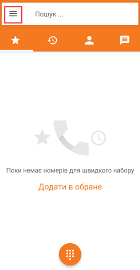

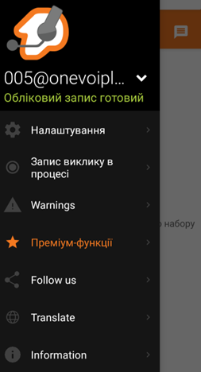

## Налаштування програми Zoiper на IOS
Налаштування софтфону Zoiper на оперативну систему IOS мобільного телефону.

У App Store необхідно завантажити додаток, який називається Zoiper Lite voip soft phone без слів Premium. 

Для того, щоб ввести дані для реєстрації в додатку Zoiper необхідно зайти в особистий кабінет OneVOIPlanet. 

1.	Натисніть **Співробітники**.

2. Натисніть на ПІБ співробітника або натисніть кнопку ... і виберіть пункт **Редагувати**.

3. Виберіть **Обліковий запис SIP** та відкриються дані співробітника: SIP-адреса, домен та пароль.

4. В додатку Zoiper підтвердіть дозвіл на доступ усіх запитів. Після підтвердження, в нижньому лівому куті натисніть **Налаштування**. 

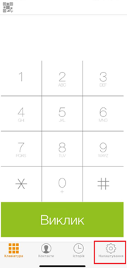

5. Оберіть **Облікові записи**.

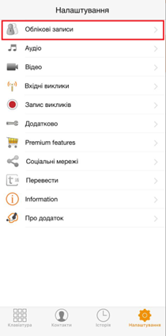

6. Натисніть у верхньому правому куті знак +.

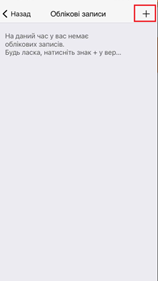

7. На запитання чи є обліковий запис натисніть Так.

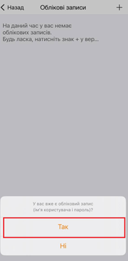

8. Оберіть **Ручне налаштування**.

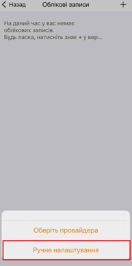

9. Виберіть **Обліковий запис SIP**.

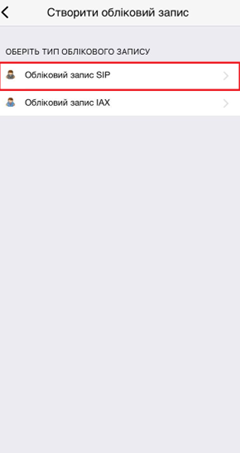

10. Заповніть рядки згідно з даних співробітника із особистого кабінету.   **Обліковий запис** - це SIP-адреса (005, наприклад)  **Домен** - це Домен та **:5070** або **:5071** без пробілу (c333.sip.onevoiplanet.com:5070, наприклад)   **Ім'я користувача** - це SIP-адреса (005, наприклад)   **Пароль** - це Пароль з Облікового запису SIP. Для цього необхідно натиснути Скопіювати та вставити в будь-яку вільну строку, щоб переглянути.   Після заповнення виділених червоним рядків натисніть зелену кнопку **Зареєструвати**.

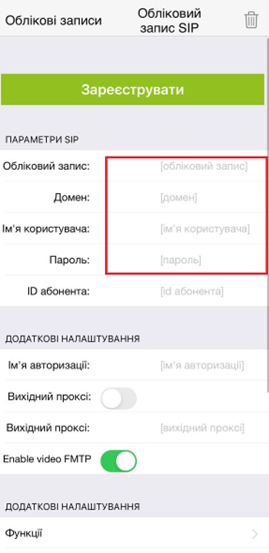

11. Для того, щоб перевірити активність статусу натиснить у верхньому лівому куті **Облікові записи**. **Зелена галочка** свідчить про те, що додаток налаштовано вірно, можна приймати та здійснювати дзвінки.

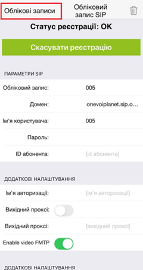
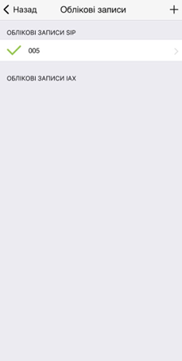
